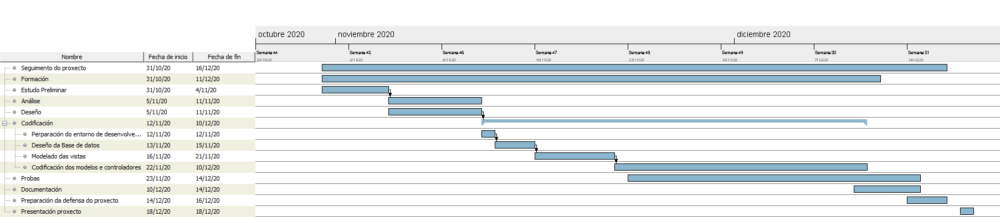

# 3.Planificación:

Para a realización do proxecto dividímolo en varias tarefas diferentes para realizar unha correcta xestión e seguimento do mesmo.

Deste xeito temos as seguintes tarefas:

- **Estudo Preliminar:**
    - **Descrición:** Nesta primeira fase analizamos o problema que temos que resolver, as posibles solucións e alternativas, facemos unha toma de requirimentos, definimos a previsión do alcance do proxecto e as tecnoloxías a empregar. Decidimos tamén a planificación preliminar e engadimos un pequeno orzamento do custo do proxecto.

    - **Duración:** 5 días.
    - **Recursos humanos:** 1 Persoa
    - **Recursos Hardware/Software:** 1 ordenador, software ofimático (Libre Office) e conexión a internet.

- **Análise:**
    - **Descrición:** Nesta fase analizamos en profundidade as operacións que se poderán levar a cabo coa aplicación para definir completamente o proxecto, realizamos unha descrición en profundidade, definimos os requirimentos funcionais e non funcionais do sistema, os requisitos para que os usuarios poidan utilizar a aplicación e a normativa aplicable.
    Ao finalizar esta fase teremos un completo alcance do proxecto que imos levar a cabo.

    - **Duración:** 7 días. 
    - **Recursos humanos:** 1 Persoa
    - **Recursos Hardware/Software:** 1 ordenador, software ofimático (Libre Office) e conexión a internet.

- **Deseño:**
    - **Descrición:** Ao chegar a esta fase xa temos definido todo o que hai que facer, e toca definir cómo facelo. Definiranse neste punto os diagramas necesarios para levar a cabo o desenvolvemento do proxecto (Modelo conceptual, casos de uso, diagrama de bases de datos, esquema da interfaz de usuario) de maneira que sexa unha guía de todo o realizado na fase de análise para posteriormente codificalo.

    - **Duración:** 7 días.
    - **Recursos Humanos:** 1 Persoa
    - **Recursos Hardware/Software:** 1 ordenador, software ofimático (Libre Office), software para o deseño de diagramas (DIA) e conexión a internet.

- **Codificación:** Nesta etapa codificaremos a aplicación, é dicir, transformaremos en código tódolos requirimentos que definimos no alcance do proxecto para ter a nosa aplicación funcional seguindo os patróns definidos na fase de deseño. 

    - **Duración:** 30 días.
    - **Recursos humanos:** 1 Persoa
    - **Recursos Hardware/Software:** 1 ordenador, 1 servidor de probas LAMP, software de desenvolvemento (Visual Studio Code), GITLAB para o aloxamento do código e control de versións, software de edición de imaxes (GIMP), conexión a internet.

- **Probas**: Unha vez rematada a codificación da aplicación (ou dunha parte) comezaríamos a pasar probas para verificar que cumpre tódolos requirimentos tanto funcionais como non funcionais. Comunmente as probas divídense en probas unitarias (probando cada unha das partes da aplicación de forma individual) e probas de integración (cando xa se pasan tódalas probas unitarias próbase o sistema completo). No caso que nos ocupa, ao ser unha aplicación sinxela realizaremos as probas unitarias a medida que imos codificando e finalmente realizaremos unha proba nun entorno de produción simulado coa aplicación finalizada.

    Ao tratarse dun proxecto relativamente pequeno a fase de probas irémola realizando xunto coa codificación.
    - **Duración:** 5 días
    - **Recursos humanos:** 1 Persoa
    - **Recursos Hardware/Software:** 1 ordenador, 1 servidor de probas LAMP, software de desenvolvemento (Visual Studio Code), GITLAB, software de edición de imaxes (GIMP), software ofimático (Libre Office), conexión a internet.

- **Documentación:** Unha vez finalizada a codificación e pasadas as probas, elabórase a documentación da aplicación. Nesta fase realizarase unha pequena guía técnica co deseño da aplicación, a codificación e as probas realizadas. Un manual de uso da aplicación e un manual de instalación.

    - **Duración:** 5 días
    - **Recursos humanos:** 1 Persoa
    - **Recursos Hardware/Software:** 1 ordenador, 1 servidor de probas LAMP, software ofimático (Libre Office), conexión a internet.

- **Explotación e mantemento:** Unha vez que a aplicación estea probada, sen erros, e sexa fiable, pasaríamos á fase de explotación na que os usuarios coñecen a aplicación e comezan a utilizala. E, como en todo ciclo de vida dun software, temos tamén a fase de **mantemento** na que a aplicación irá evolucionando e adaptándose aos novos tempos, novas tecnoloxías que vaian aparecendo, optimizándose e medrará conforme aos requirimentos que necesite o cliente.

    Esta fase avaliaríase xunto cos requirimentos do cliente para ver a duración temporal, os recursos que lle temos que adicar, etc. Soe ser a fase máis longa dun ciclo de vida do software.

A fase de **explotación e mantemento** non a vamos engadir no noso diagrama de GANTT xa que, ao tratarse dun proxecto educativo vai ter un final establecido. Engadimos catro fases máis que sí que se terán en consideración para a planificación temporal do proxecto. Son as seguintes:

- **Seguimento do proxecto:** Ao longo de toda a duración do proxecto realízasenos un seguimento por parte do tutor para revisar todo o traballo que levamos feito, saber se imos adiantados, retrasados e solventar as dúbidas que van xurdindo. O seguimento durará todo o tempo que dure o proxecto.

- **Formación:** Esta etapa, no noso caso vai dende o inicio do proxecto ata o final, ao estar traballando cun framework que ata o momento descoñeciamos o seu funcionamento (Laravel) faise imprescindible irse formando e revisando documentación a medida que imos avanzando no proxecto.

- **Preparación da defensa do proxecto:** Nesta fase prepararemos unha pequena presentación para explicar o funcionamento do proxecto e as características do mesmo.
    - **Duración:** 3 días
    - **Recursos humanos:** 1 Persoa
    - **Recursos Hardware/Software:** 1 ordenador, 1 servidor de probas LAMP, software ofimático (Libre Office), conexión a internet.

- **Defensa do proxecto:** Este será o último hito do proxecto no cal presentaremos o proxecto ante o tribunal e mostraremos o seu funcionamento.

A **metodoloxía** que vamos empregar para desenvolver este proxecto vai ser unha metodoloxía en cascada, xa que se trata dunha aplicación pequena na que están ben definidas as funcións a implementar.

De todas formas teremos algunha fase na que solaparemos algunhas tarefas con outras para ir gañando tempo, por exemplo, as fases de análise e deseño ímolas realizar pegadas para tratar de ir esquematizando os requerimentos, a fase de probas solaparase habitualmente coa de codificación ainda que adicaremos algún tempo a facer probas tras ter todo rematado.

O **calendario de traballo** vai comprender tódolos días da semana (incluso sábados e domingos) e cada xornada dunha media de 4 horas.
  
Móstrase a continuación un Diagrama de Gantt no que se mostran tódalas fases do proxecto.

Mostramos tamén unha táboa coas datas de inicio e fin de cada tarefa:

[->Continuar a "ORZAMENTO"](04_Orzamento.md)