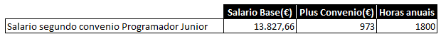
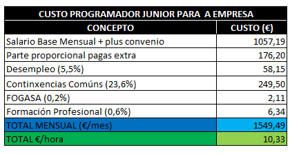
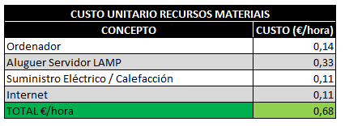
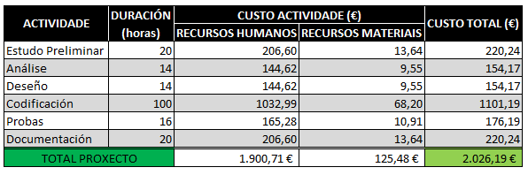

# 4.Orzamento

Imos amosar a continuación un pequeno orzamento do custo de elaboración do proxecto desglosando para elo os custos de cada actividade e dos recursos materiais.

### **ORZAMENTO DESENVOLVEMENTO PROXECTO XESTOR DE INCIDENCIAS**

Para o cálculo das horas estimamos unha media de 4 horas diarias durante toda a vida de realización do proxecto (inclusive sábados e domingos), resultando un total de 184 horas.

Indicamos a continuación o custo unitario de cada recurso para finalmente realizar un orzamento por actividade.

***CÁLCULO DE CUSTO UNITARIO DE RECURSOS HUMANOS:***

Para o cálculo do custo unitario para unha empresa dun recurso humano tomamos como referencia o custo salarial segundo convenio dun programador junior, que será o único recurso humano necesario para a realización do proxecto:

*Datos obtidos do [Convenio Colectivo estatal de empresas de consultoría e estudos de mercado e da opinión pública](https://www.boe.es/boe/dias/2018/03/06/pdfs/BOE-A-2018-3156.pdf)*

Tendo en conta o salario base podemos calcular o custo por hora que lle supón á empresa o traballador:

***CÁLCULO DE CUSTO UNITARIO DE RECURSOS MATERIAIS:***

Para o cálculo do custo unitario por hora dos recursos materiais, consideramos o seguinte:

Ordenador -> Tívose en conta o custo dun ordenador medio dun prezo de 600€  do que calculamos unha vida útil de 2 anos (tempo de garantía) e o uso darémosllo durante as 184 horas que dura o proxecto.

Aluguer Servidor -> O alugueiro do servidor web é imputable totalmente ao proxecto, polo que o custo total (120€ polos dous meses que dura o proxecto) se divide entre as 184 horas do proxecto.

Suministros -> Fíxose o cálculo por hora a través de facturas reais.

O custo unitario dos recursos materiais é o seguinte:

### **ORZAMENTO PROXECTO XESTOR INCIDENCIAS:**

Tendo en conta todo o anterior realizamos o orzamento por actividade quedando da seguinte maneira:

[->Continuar a "ANÁLISE"](05_Analise.md)
