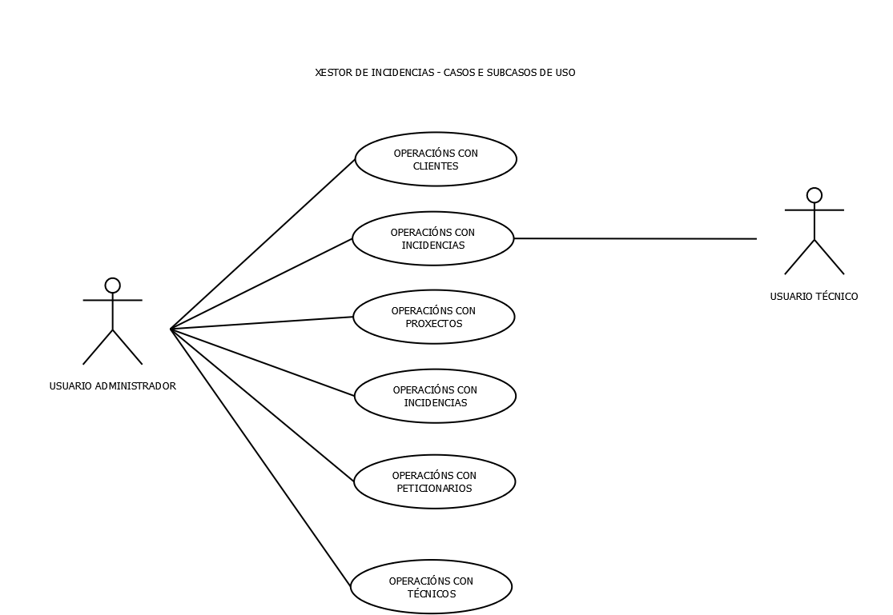

# 6. Deseño:

Unha vez temos definido o alcance realizado na fase de análise procederemos a deseñar os algoritmos para implementar cada unha das funcións definidas con diferentes diagramas.

## Modelo Conceptual:

O modelo conceptual describe cómo se relacionan os conceptos do proxecto, é dicir, sérvenos para representar o problema que plantexamos de maneira gráfica, permitindo indentificar, organizar e realizar razoamentos sobre os diferentes compoñentes do sistema.

Describimos a continuación cada un dos compoñentes do noso modelo.

|Cliente| |
|------|------|
|Descrición| Representa a un cliente no sistema. Un cliente é unha persoa ou empresa que utiliza os nosos servizos (encárganos traballos) agrupados por proxectos.|
|Atributos|Os datos que necesitamos dun cliente son: id, código cliente, nome fiscal, nome comercial, cif, dirección, teléfono e email.|
|Relacións|Un cliente xestionará un proxecto ou varios proxectos, poderemos ter clientes sen proxectos asignados, pero non teremos nunca un proxecto que non teña un cliente asociado.|
|Accións|As accións que poderemos realizar cos clientes serán: rexistrar novos clientes, listar os clientes existentes, modificar clientes existentes e eliminar clientes (sempre e cando non teñan proxectos asociados).|

|Proxecto| |
|------|------|
|Descrición| Representa un proxecto no sistema. Un proxecto é unha agrupación de traballos (incidencias) que xestiona un cliente.|
|Atributos|Os datos que necesitamos dun proxecto son: id, código proxecto, nome do proxecto, a data de inicio e a data de fin.|
|Relacións|Un proxecto está xestionado únicamente por un cliente e, á sua vez, un proxecto pode ter unha ou varias incidencias asociadas. Poderá haber proxectos que non teñan incidencias asignadas, pero toda incidencia estará asociada a un proxecto.|
|Accións|As Accións que poderemos realizar cos proxectos serán: rexistrar novos proxectos, listar os proxectos existentes, modificar proxectos existentes e eliminar proxectos (sempre e cando non teñan incidencias asociadas).|

|Incidencia| |
|------|------|
|Descrición| Representa unha incidencia no sistema. Unha incidencia é un traballo que nos asigna un cliente vinculada a un proxecto. No caso que nos ocupa, unha incidencia consiste nun traballo que o noso cliente nos encarga no domicilio dun terceiro|
|Atributos|Os datos que necesitamos dunha incidencia son: id, código de incidencia propio, código de incidencia do cliente, nome descriptivo da incidencia, unha descripción do traballo a realizar, a data na que se solicita, a data na que a planificamos, a data na que acudimos finalmente, a persoa de contacto que nos vai atender no lugar da incidencia, un teléfono de contacto da persoa que nos atenderá no lugar da incidencia e a dirección á que teremos que acudir.|
|Relacións|Unha incidencia pertencerá únicamente a un proxecto. A unha incidencia acudirá un único técnico. Ao longo do tempo unha incidencia pasará por diferentes estados e, por último unha incidencia terá un único peticionario.|
|Accións|As Accións que poderemos realizar coas incidencias son: rexistrar novas incidencias, listar as incidencias existentes e modificar incidencias existentes. Non estará permitido o borrado das incidencias por requirimento do cliente|

|Peticionario| |
|------|------|
|Descrición| Representa un peticionario no sistema. Un peticionario é a persoa que nos envía un correo coa información da incidencia, habitualmente os peticionarios soen ser sempre os mesmos, polo que os almacenamos nunha táboa aparte. A estes peticionarios serán aos que notificaremos por correo electrónico da situación da incidencia a medida que imos avanzando na mesma.|
|Atributos|Os datos que necesitamos dun peticionario son un id, o seu nome e apelidos, un email e un teléfono de contacto.|
|Relacións|Un peticionario pode solicitar varias incidencias, pero unha incidencia vai pertencer únicamente a un peticionario. Poderemos ter peticionarios que non teñan incidencias asignadas, pero non poderemos ter incidencias que non as solicite ningún peticionario.|
|Accións|As Accións que poderemos realizar cos peticionarios son: rexistrar novos peticionarios, listar ou modificar os peticionarios existentes e eliminar peticionarios (sempre e cando non houberan solicitado ningunha incidencia).|

|Estado| |
|------|------|
|Descrición| Representa un estado dunha incidencia no sistema. Os estados son os "movementos" polos que vai pasando a incidencia ao longo do seu ciclo de vida, unha incidencia primeiro rexístrase, logo asígnase a un técnico, acúdese a ela, finalízase e péchase. Tamén se pode cancelar.|
|Atributos|Dos estados únicamente nos interesa o seu nome e a súa id.|
|Relacións|Unha incidencia pode pasar por diferentes estados ao longo do seu ciclo de vida, e un mesmo estado pódeno ter varias incidencias ao mesmo tempo. Interésanos gardar tamén a data de cambio de estado para ter un histórico de cando unha incidencia pasou dun estado a outro.|
|Accións|Non se contemplan accións específicas cos estados, estarán predefinidos na base de datos como Rexistrada, Planificada, En Proceso, Finalizada e Cancelada. O cambio de estado irase producindo a medida que se vai avanzando na resolución da incidencia coas accións quer realice o administrador ou o técnico.|

|Técnico| |
|------|------|
|Descrición| Representa un técnico no sistema. Un técnico é a persoa que acude a realizar unha incidencia.|
|Atributos|Os datos que necesitamos dun técnico son un id, o seu nome e apelidos, un email e un teléfono de contacto.|
|Relacións|Un técnico pode acudir a varias incidencias, pero a unha incidencia vai asistir únicamente un técnico. Poderemos ter técnicos que non teñan incidencias asignadas e incidencias que non teñan técnicos asignados nun momento dado.|
|Accións|As Accións que poderemos realizar cos técnicos son: rexistrar novos técnicos, listar ou modificar os técnicos existentes e eliminar técnicos (sempre e cando non houberan asistido a ningunha incidencia).|

## Casos de uso:

A continuación definiremos os casos de uso da nosa aplicación. O diagrama de casos de uso describe as actividades que debe realizar cada usuario para levar a cabo un proceso dentro da aplicación. Dentro do noso proxecto temos sete operacións diferenciadas (unha por cada entidade) e dentro de cada operación definimos o caso de uso para os actores que poden actuar en cada caso.

Mostramos a continuación o diagrama xeral de tódalas operacións e definiremos despois cada operación por separado describindo cada caso de uso.

***CASOS DE USO ADMINISTRADOR - CLIENTES***

|**CASO DE USO**|C.U.01 - Crear Cliente|
|------|------|
|**ACTORES:**|Usuario Administrador|
|**PRECONDICIÓNS**|O usuario administrador debe ter a sesión iniciada|
|**DESCRIPCIÓN**|1. O usuario accederá a un formulario de creación de clientes. 2. Enche o formulario cos datos do novo cliente. 3. Pulsa o botón para rexistrar. 4. O sistema retorna un listado de clientes e mostra unha mensaxe de éxito.|
|**POSIBLES VARIACIÓNS**|1. O usuario cubre mal o formulario de alta: Neste caso non se enviaría o formulario, e mostrará unha mensaxe cos erros. 2.O usuario cubre ben todo pero o cliente xa existe: Regrésase ao listado de clientes e amósase o erro.|

|**CASO DE USO**|C.U.02 - Modificar Cliente|
|------|------|
|**ACTORES:**|Usuario Administrador|
|**PRECONDICIÓNS**|O usuario administrador debe ter a sesión iniciada|
|**DESCRIPCIÓN**|1. O usuario accederá a un formulario de modificación de clientes. 2. Modifica os datos necesarios. 3. Pulsa o botón para modificar. 4. O sistema retorna un listado de clientes e mostra unha mensaxe de éxito.|
|**POSIBLES VARIACIÓNS**|1. O usuario cubre mal o formulario de modificación: Neste caso non se enviaría o formulario, e mostrará unha mensaxe cos erros.|

|**CASO DE USO**|C.U.03 - Borrar Cliente|
|------|------|
|**ACTORES:**|Usuario Administrador|
|**PRECONDICIÓNS**|O usuario administrador debe ter a sesión iniciada|
|**DESCRIPCIÓN**|1. O usuario premerá sobre un botón habilitado para borrar un cliente. 2. Mostrarase unha mensaxe para confirmar o borrado. 3. Pulsa o botón para borrar. 4. O sistema retorna un listado de clientes e mostra unha mensaxe de éxito.|
|**POSIBLES VARIACIÓNS**|1. O usuario non confirma o borrado: Regrésase ao listado de clientes. 2. O usuario confirma o borrado pero o cliente ten proxectos asociados: Regrésase ao listado de clientes e indícase que non se borrou por ese motivo.|

|**CASO DE USO**|C.U.04 - Ver Cliente|
|------|------|
|**ACTORES:**|Usuario Administrador|
|**PRECONDICIÓNS**|O usuario administrador debe ter a sesión iniciada|
|**DESCRIPCIÓN**|1. O usuario premerá sobre un botón habilitado para ver un cliente. 2. Mostrarase unha ventá cos datos do cliente.|

|**CASO DE USO**|C.U.05 - Listar Clientes|
|------|------|
|**ACTORES:**|Usuario Administrador|
|**PRECONDICIÓNS**|O usuario administrador debe ter a sesión iniciada|
|**DESCRIPCIÓN**|1. O usuario accederá a unha páxina para visualizar un listado de clientes. Na páxina aparecerá unha táboa con tódolos clientes paxinada nun máximo de 8 filas. esa páxina terá un buscador no que se poderá buscar por un ou varios campos en función dos desexos do cliente. Ao premer o botón de buscar mostrará o cliente ou clientes que cumplan os requisitos.|

***CASOS DE USO ADMINISTRADOR - PROXECTOS***

|**CASO DE USO**|C.U.06 - Crear Proxecto|
|------|------|
|**ACTORES:**|Usuario Administrador|
|**PRECONDICIÓNS**|O usuario administrador debe ter a sesión iniciada|
|**DESCRIPCIÓN**|1. O usuario accederá a un formulario de creación de proxectos. 2. Enche o formulario cos datos do novo proxecto. 3. Pulsa o botón para rexistrar. 4. O sistema retorna un listado de proxectos e mostra unha mensaxe de éxito.|
|**POSIBLES VARIACIÓNS**|1. O usuario cubre mal o formulario de alta: Neste caso non se enviaría o formulario, e mostrará unha mensaxe cos erros. 2.O usuario cubre ben todo pero o proxecto xa existe: Regrésase ao listado de proxectos e amósase o erro.|

|**CASO DE USO**|C.U.07 - Modificar Proxecto|
|------|------|
|**ACTORES:**|Usuario Administrador|
|**PRECONDICIÓNS**|O usuario administrador debe ter a sesión iniciada|
|**DESCRIPCIÓN**|1. O usuario accederá a un formulario de modificación de proxectos. 2. Modifica os datos necesarios. 3. Pulsa o botón para modificar. 4. O sistema retorna un listado de proxectos e mostra unha mensaxe de éxito.|
|**POSIBLES VARIACIÓNS**|1. O usuario cubre mal o formulario de modificación: Neste caso non se enviaría o formulario, e mostrará unha mensaxe cos erros.|

|**CASO DE USO**|C.U.08 - Borrar Proxecto|
|------|------|
|**ACTORES:**|Usuario Administrador|
|**PRECONDICIÓNS**|O usuario administrador debe ter a sesión iniciada|
|**DESCRIPCIÓN**|1. O usuario premerá sobre un botón habilitado para borrar un proxecto. 2. Mostrarase unha mensaxe para confirmar o borrado. 3. Pulsa o botón para borrar. 4. O sistema retorna un listado de proxectos e mostra unha mensaxe de éxito.|
|**POSIBLES VARIACIÓNS**|1. O usuario non confirma o borrado: Regrésase ao listado de proxectos. 2. O usuario confirma o borrado pero o proxecto ten proxectos asociados: Regrésase ao listado de proxectos e indícase que non se borrou por ese motivo.|

|**CASO DE USO**|C.U.09 - Ver Proxecto|
|------|------|
|**ACTORES:**|Usuario Administrador|
|**PRECONDICIÓNS**|O usuario administrador debe ter a sesión iniciada|
|**DESCRIPCIÓN**|1. O usuario premerá sobre un botón habilitado para ver un proxecto. 2. Mostrarase unha ventá cos datos do proxecto.|

|**CASO DE USO**|C.U.10 - Listar Proxectos|
|------|------|
|**ACTORES:**|Usuario Administrador|
|**PRECONDICIÓNS**|O usuario administrador debe ter a sesión iniciada|
|**DESCRIPCIÓN**|1. O usuario accederá a unha páxina para visualizar un listado de proxectos. Na páxina aparecerá unha táboa con tódolos proxectos paxinada nun máximo de 8 filas. esa páxina terá un buscador no que se poderá buscar por un ou varios campos en función dos desexos do usuario. Ao premer o botón de buscar mostrará o proxecto ou proxectos que cumplan os requisitos.|

***CASOS DE USO ADMINISTRADOR - INCIDENCIAS***

|**CASO DE USO**|C.U.11 - Crear Incidencia|
|------|------|
|**ACTORES:**|Usuario Administrador|
|**PRECONDICIÓNS**|O usuario administrador debe ter a sesión iniciada|
|**DESCRIPCIÓN**|1. O usuario accederá a un formulario de creación de incidencias. 2. Enche o formulario cos datos da nova incidencia. 3. Pulsa o botón para rexistrar. 4. O sistema retorna un listado de incidencias e mostra unha mensaxe de éxito.|
|**POSIBLES VARIACIÓNS**|1. O usuario cubre mal o formulario de alta: Neste caso non se enviaría o formulario, e mostrará unha mensaxe cos erros. 2. O usuario cubre ben todo pero a incidencia xa existe: Regrésase ao listado de proxectos e amósase o erro.|

|**CASO DE USO**|C.U.12 - Modificar Incidencia|
|------|------|
|**ACTORES:**|Usuario Administrador|
|**PRECONDICIÓNS**|O usuario administrador debe ter a sesión iniciada|
|**DESCRIPCIÓN**|1. O usuario accederá a un formulario de modificación de incidencias. 2. Modifica os datos necesarios. 3. Pulsa o botón para modificar. 4. O sistema retorna un listado de incidencias e mostra unha mensaxe de éxito.|
|**POSIBLES VARIACIÓNS**|1. O usuario cubre mal o formulario de modificación: Neste caso non se enviaría o formulario, e mostrará unha mensaxe cos erros.|

|**CASO DE USO**|C.U.13 - Ver Incidencia|
|------|------|
|**ACTORES:**|Usuario Administrador|
|**PRECONDICIÓNS**|O usuario administrador debe ter a sesión iniciada|
|**DESCRIPCIÓN**|1. O usuario premerá sobre un botón habilitado para ver unha incidencia. 2. Mostrarase unha ventá cos datos da incidencia.|

|**CASO DE USO**|C.U.14 - Listar Incidencias|
|------|------|
|**ACTORES:**|Usuario Administrador|
|**PRECONDICIÓNS**|O usuario administrador debe ter a sesión iniciada|
|**DESCRIPCIÓN**|1. O usuario accederá a unha páxina para visualizar un listado de incidencias. Na páxina aparecerá unha táboa con tódolas incidencias paxinada nun máximo de 8 filas. esa páxina terá un buscador no que se poderá buscar por un ou varios campos en función dos desexos do usuario. Ao premer o botón de buscar mostrará a incidencia ou incidencias que cumplan os requisitos.|

***CASOS DE USO ADMINISTRADOR - PETICIONARIOS***

|**CASO DE USO**|C.U.15 - Crear Peticionario|
|------|------|
|**ACTORES:**|Usuario Administrador|
|**PRECONDICIÓNS**|O usuario administrador debe ter a sesión iniciada|
|**DESCRIPCIÓN**|1. O usuario accederá a un formulario de creación de peticionarios. 2. Enche o formulario cos datos do novo peticionario. 3. Pulsa o botón para rexistrar. 4. O sistema retorna un listado de peticionarios e mostra unha mensaxe de éxito.|
|**POSIBLES VARIACIÓNS**|1. O usuario cubre mal o formulario de alta: Neste caso non se enviaría o formulario, e mostrará unha mensaxe cos erros. 2.O usuario cubre ben todo pero o peticionario xa existe: Regrésase ao listado de peticionarios e amósase o erro.|

|**CASO DE USO**|C.U.16 - Modificar Peticionario|
|------|------|
|**ACTORES:**|Usuario Administrador|
|**PRECONDICIÓNS**|O usuario administrador debe ter a sesión iniciada|
|**DESCRIPCIÓN**|1. O usuario accederá a un formulario de modificación de peticionarios. 2. Modifica os datos necesarios. 3. Pulsa o botón para modificar. 4. O sistema retorna un listado de peticionarios e mostra unha mensaxe de éxito.|
|**POSIBLES VARIACIÓNS**|1. O usuario cubre mal o formulario de modificación: Neste caso non se enviaría o formulario, e mostrará unha mensaxe cos erros.|

|**CASO DE USO**|C.U.17 - Borrar Peticionario|
|------|------|
|**ACTORES:**|Usuario Administrador|
|**PRECONDICIÓNS**|O usuario administrador debe ter a sesión iniciada|
|**DESCRIPCIÓN**|1. O usuario premerá sobre un botón habilitado para borrar un peticionario. 2. Mostrarase unha mensaxe para confirmar o borrado. 3. Pulsa o botón para borrar. 4. O sistema retorna un listado de peticionarios e mostra unha mensaxe de éxito.|
|**POSIBLES VARIACIÓNS**|1. O usuario non confirma o borrado: Regrésase ao listado de peticionarios. 2. O usuario confirma o borrado pero o peticionario ten incidencias asociadas: Regrésase ao listado de peticionarios e indícase que non se borrou por ese motivo.|

|**CASO DE USO**|C.U.18 - Ver Peticionario|
|------|------|
|**ACTORES:**|Usuario Administrador|
|**PRECONDICIÓNS**|O usuario administrador debe ter a sesión iniciada|
|**DESCRIPCIÓN**|1. O usuario premerá sobre un botón habilitado para ver un peticionario. 2. Mostrarase unha ventá cos datos do peticionario.|

|**CASO DE USO**|C.U.19 - Listar Peticionarios|
|------|------|
|**ACTORES:**|Usuario Administrador|
|**PRECONDICIÓNS**|O usuario administrador debe ter a sesión iniciada|
|**DESCRIPCIÓN**|1. O usuario accederá a unha páxina para visualizar un listado de peticionarios. Na páxina aparecerá unha táboa con tódolos peticionarios paxinada nun máximo de 8 filas. esa páxina terá un buscador no que se poderá buscar por un ou varios campos en función dos desexos do usuario. Ao premer o botón de buscar mostrará o peticionario ou peticionarios que cumplan os requisitos.|

***CASOS DE USO ADMINISTRADOR - TÉCNICOS***

|**CASO DE USO**|C.U.20 - Crear Técnico|
|------|------|
|**ACTORES:**|Usuario Administrador|
|**PRECONDICIÓNS**|O usuario administrador debe ter a sesión iniciada|
|**DESCRIPCIÓN**|1. O usuario accederá a un formulario de creación de técnicos. 2. Enche o formulario cos datos do novo técnico. 3. Pulsa o botón para rexistrar. 4. O sistema retorna un listado de técnicos e mostra unha mensaxe de éxito.|
|**POSIBLES VARIACIÓNS**|1. O usuario cubre mal o formulario de alta: Neste caso non se enviaría o formulario, e mostrará unha mensaxe cos erros. 2.O usuario cubre ben todo pero o técnico xa existe: Regrésase ao listado de técnicos e amósase o erro.|

|**CASO DE USO**|C.U.21 - Modificar Técnico|
|------|------|
|**ACTORES:**|Usuario Administrador|
|**PRECONDICIÓNS**|O usuario administrador debe ter a sesión iniciada|
|**DESCRIPCIÓN**|1. O usuario accederá a un formulario de modificación de técnicos. 2. Modifica os datos necesarios. 3. Pulsa o botón para modificar. 4. O sistema retorna un listado de técnicos e mostra unha mensaxe de éxito.|
|**POSIBLES VARIACIÓNS**|1. O usuario cubre mal o formulario de modificación: Neste caso non se enviaría o formulario, e mostrará unha mensaxe cos erros.|

|**CASO DE USO**|C.U.22 - Borrar Técnico|
|------|------|
|**ACTORES:**|Usuario Administrador|
|**PRECONDICIÓNS**|O usuario administrador debe ter a sesión iniciada|
|**DESCRIPCIÓN**|1. O usuario premerá sobre un botón habilitado para borrar un técnico. 2. Mostrarase unha mensaxe para confirmar o borrado. 3. Pulsa o botón para borrar. 4. O sistema retorna un listado de técnicos e mostra unha mensaxe de éxito.|
|**POSIBLES VARIACIÓNS**|1. O usuario non confirma o borrado: Regrésase ao listado de técnicos. 2. O usuario confirma o borrado pero o técnico ten incidencias asociadas: Regrésase ao listado de técnicos e indícase que non se borrou por ese motivo.|

|**CASO DE USO**|C.U.23 - Ver Técnico|
|------|------|
|**ACTORES:**|Usuario Administrador|
|**PRECONDICIÓNS**|O usuario administrador debe ter a sesión iniciada|
|**DESCRIPCIÓN**|1. O usuario premerá sobre un botón habilitado para ver un técnico. 2. Mostrarase unha ventá cos datos do técnico.|

|**CASO DE USO**|C.U.24 - Listar Técnicos|
|------|------|
|**ACTORES:**|Usuario Administrador|
|**PRECONDICIÓNS**|O usuario administrador debe ter a sesión iniciada|
|**DESCRIPCIÓN**|1. O usuario accederá a unha páxina para visualizar un listado de técnicos. Na páxina aparecerá unha táboa con tódolos técnicos paxinada nun máximo de 8 filas. esa páxina terá un buscador no que se poderá buscar por un ou varios campos en función dos desexos do usuario. Ao premer o botón de buscar mostrará o técnico ou técnicos que cumplan os requisitos.|

***CASOS DE USO TÉCNICO - INCIDENCIAS***

|**CASO DE USO**|C.U.25 - Listar Incidencias|
|------|------|
|**ACTORES:**|Usuario Técnico|
|**PRECONDICIÓNS**|O usuario técnico debe ter a sesión iniciada|
|**DESCRIPCIÓN**|1. O usuario accederá a unha ventá na que se mostran únicamente as incidencias que ten asignadas.|

|**CASO DE USO**|C.U.26 - Ver Incidencia|
|------|------|
|**ACTORES:**|Usuario Técnico|
|**PRECONDICIÓNS**|O usuario técnico debe ter a sesión iniciada|
|**DESCRIPCIÓN**|1. O usuario terá un botón no que poderá premer e ver os detalles da incidencia que desexe. Non poderá modificar nada.|

|**CASO DE USO**|C.U.27 - Indicar Chegada|
|------|------|
|**ACTORES:**|Usuario Técnico|
|**PRECONDICIÓNS**|O usuario técnico debe ter a sesión iniciada|
|**DESCRIPCIÓN**|1. O usuario premerá sobre un botón habilitado para marcar a chegada. Ese botón recollerá a data e hora actual.|

|**CASO DE USO**|C.U.28 - Indicar Finalización|
|------|------|
|**ACTORES:**|Usuario Administrador|
|**PRECONDICIÓNS**|O usuario administrador debe ter a sesión iniciada|
|**DESCRIPCIÓN**|1. O usuario premerá sobre un botón habilitado para marcar a finalización. Ese botón recollerá a data e hora actual.|

## Deseño de interface de usuarios:

Móstranse a continuación os esquemas das páxinas utilizadas. Para o deseño da interface utilizarase bootstrap co theme yeti.css.

O deseño de tódalas páxinas é similar tentando ser páxinas simples e coas que o usuario se encontre cómodo e non teña dúbidas.

A aplicación é totalmente responsive, adaptándose a tódolos tamaños de pantalla.

Mostramos a continuación os diagramas máis relevantes:

***PÁXINA INICIO***

Na páxina de inicio mostraranse as incidencias planificadas para o día actual. No caso dun usuario administrador mostraranse  as incidencias de tódolos técnicos e terá acceso a todo o menú superior.

No caso dun usuario técnico só terá acceso ás suas incidencias e non terá acceso a ningún elemento do menú.

***PÁXINA TIPO CLIENTES/PROXECTOS/USUARIOS/PETICIONARIOS***

As páxinas de clientes, proxectos, técnicos/usuarios e peticionarios teñen a mesma estrutura, na parte superior está o menú de acceso a cada sección. A continuación aparece un breadcrumb indicando onde nos atopamos e dando a opción de voltar ao inicio.

Logo temos un pequeno buscador con varios campos para filtrar no que poderemos filtrar por un ou varios deles.

Por último temos unha táboa cos resultados que teñamos de clientes, proxectos, tecnicos/usuarios ou peticionarios dependendo da sección na que nos atopemos.

En cada ítem da táboa teremos un botón para ver, modificar ou eliminar o rexistro sobre o que estamos actuando.

Ao fondo da táboa teremos un botón para insertar novos rexistros.

***PÁXINA LISTADO DE INCIDENCIAS***

Nesta páxina, como na anterior, temos un menú seguido dun breadcrumb.

A continuación terá un buscador para filtrar por un ou máis campos.

Por último temos unha táboa cos resultados que teñamos de incidencias. Esta táboa terá unha peculiaridade con respecto á anterior, ainda que coa limitación do software empregado para a realización dos diagramas non o podemos indicar visualmente, as celdas da columna de estado cambiarán de cor en función do estado da incidencia da seguinte maneira:

- Branco -> Incidencia Rexistrada
- Azul -> Incidencia Planificada
- Amarelo -> Incidencia En proceso
- Verde -> Incidencia Finalizada
- Vermello -> Incidencia Cancelada

En cada ítem da táboa teremos un botón para ver, modificar, planificar ou cancelar a incidencia sobre o que estamos actuando.

Ao fondo da táboa teremos un botón para insertar novos rexistros.

***PÁXINA REXISTRO DE INCIDENCIAS***

Nesta páxina móstrase un formulario para crear novas incidencias:

***VENTÁS MODAIS TIPO***
Para a creación, modificación, planificación e cancelación/borrado empregaremos ventás modais, estos son os tipos:

***VENTÁ TIPO CREACIÓN/REXISTRO***

Mostrará nunha ventá modal os campos do formulario a para engadir un rexistro.

***VENTÁ TIPO VISUALIZACIÓN***

Mostrará nunha ventá modal os campos do formulario que queremos mostrar. Os campos non se poderán editar.

***VENTÁ TIPO MODIFICACIÓN***

Mostrará nunha ventá modal os campos do formulario a modificar.

***VENTÁ TIPO CANCELACIÓN / BORRADO***

Mostrará nunha ventá modal a confirmación para borrar o elemento sobre o que estamos actuando.

***DESEÑO RESPONSIVE***

A aplicación adáptase a todo tipo de tamaño de pantallas, a continuación móstrase unha imaxe da aplicación en diferentes dispositivos:

## Diagrama de Base de Datos:

**DIAGRAMA ENTIDADE/RELACIÓN**

Coa definición feita de cada compoñente no modelo conceptual podemos xa analizar e realizar o modelo E/R para deseñar a base de datos na que se almacenarán tódolos datos da nosa aplicación.

**MODELO RELACIONAL**

Unha vez realizado o modelo entidade relación podemos pasar xa a realizar o modelo relacional. Para elo, realizamos o paso de Entidade/Relación a modelo relacional aplicando as seguintes reglas:

- Transformación relacions 1:N: Engadimos á entidade do lado N a clave primaria da entidade 1.

- Tranformación relacións N:N: Creamos unha nova relación formada pola clave primaria das dúas entidades relacionadas. A clave primaria desta nova entidade é o conxunto das claves primarias das entidades que se relacionan con esta nova relación.

Mostramos a continuación o paso de Entidade Relación a Relacional:

Como resultado deste paso obtemos o seguinte **modelo relacional**:

**DIAGRAMA DE COMPOÑENTES**

Mediante o diagrama de compoñentes mostramos a organización e dependencias entre un conxunto de compoñentes.

No caso que nos ocupa, o framework utilizado para o desenvolvemento (laravel) utiliza o patrón de deseño MVC (Modelo Vista Controlador). Neste modelo, o usuario interactúa coa interfaz de usuario. 

Definimos en termos xerais as dependencias neste modelo.

Cando o usuario tenta realizar unha acción o *CONTROLADOR* recibe a petición do usuario. E realiza as seguintes accións:

- Accede ao modelo para recoller os datos.
- O modelo recibe a petición e realiza a consulta na Base de Datos.
- A base de datos devolve os datos.
- O Modelo envía os datos ao controlador.
- O Controlador pasa os datos á vista.
- A vista procesa os datos e devolve ao controlador a páxina HTML.
- O controlador envía ao usuario a páxina.

En definitiva, o diagrama de compoñentes queda da seguinte maneira:

**DIAGRAMA DE PAQUETES**

A través do diagrama de paquetes representamos os paquetes (agrupación de clases, vistas, modelos) e a dependencia entre eles.

**DIAGRAMA DE DESPREGUE**

Mediante o diagrama de despregue mostramos a disposición física dos nodos que compoñen un sistema e o reparto dos compoñentes sobre eses nodos.

No caso que nos ocupa representamos o seguinte:

O usuario accede ao Xestor de Incidencias a través dun PC ou dun dispositivo móbil, os paquetes da aplicación están nun servidor web e a base de datos está no mesmo servidor web. Por outra banda a aplicación envía notificacións por correo electrónico a medida que se avanza no proceso dunha incidencia. O servidor de correo electrónico neste caso é externo (utilízase un correo de GMAIL), quedando a representación da seguinte maneira:

**DIAGRAMA DE INTERACCIÓN**

A tavés do diagrama de interacción vemos cómo interactúan os compoñentes principais do sistema para cumplir as súas funcións.

Con Laravel tódalas peticións siguen sempre o mesmo esquema:

- O cliente solicita unha acción ao controlador.
- O Controlador solicita os datos ao modelo.
- O Modelo devolve os datos ao controlador.
- O Controlador envía os datos recuperados á vista.
- A Vista devolve os datos formateados ao controlador.
- O Controlador devolve a páxina ao cliente.

O esquema xeral é o seguinte:

Imos analizar un pouco máis o ciclo de vida dunha petición na nosa aplicación desenvolvendo gráficamente o camiño que sigue unha petición dende que o usuario a solicita ata que se lle devolve a solicitude. 

Cando un usuario solicita acceso a unha páxina da nosa aplicación pasa o seguinte:

- A petición trasládase ao arquivo de rutas. Alí verifícase se a ruta existe, de non existir móstrase un erro 404 de páxina non encontrada, e no caso de existir envíase a petición a un Middleware.

- Os Middleware son os encargados de filtrar as peticións, no noso caso temos dous, un que verifica que o usuario está rexistrado e outro que verifica o rol cos permisos necesarios. No caso de que o usuario non estea rexistrado redirixirase á páxina de Login, e no caso de que estea rexistrado pero non teña permisos redirixirase á páxina de inicio.

- No caso de que o usuario estea rexistrado e teña permisos suficientes a ruta chama ao controlador que se vai executar.

- O controlador accede ao modelo para recoller os datos solicitados.

- O modelo realiza a consulta á base de datos.

- A base de datos devolve os datos obtidos.

- O modelo envía os datos ao controlador.

- O controlador envía os datos á vista para que os procese.

- A vista procesa os datos, tranfórmaos e devolve a páxina HTML ao controlador.

- O controlador envía a páxina solicitada ao usuario.

Mostramos a continuación un esquema do acceso dun usuario á páxina de INCIDENCIAS:

**DIAGRAMA DE ESTADOS**

Mediante o diagrama de estados dámoslle forma a ao comportamento dunha clase. Móstrase a secuencia de estados que un obxeto da clase ten durante o seu ciclo de vida segundo as accións que van sucedendo. No noso caso imos representar o diagrama de estado dos estados polos que vai pasando unha incidencia a medida que avanza a súa realización:

[->Continuar a Implantación](07_Implantacion.md)