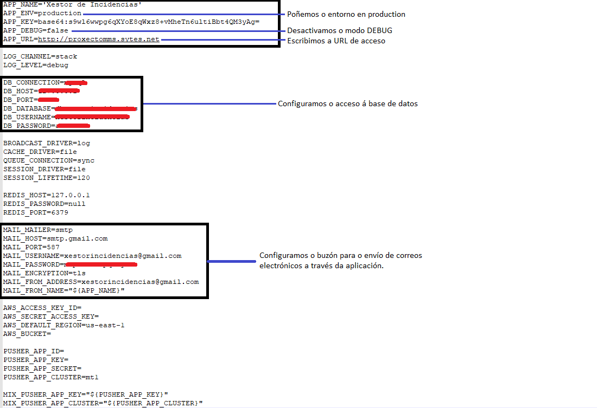
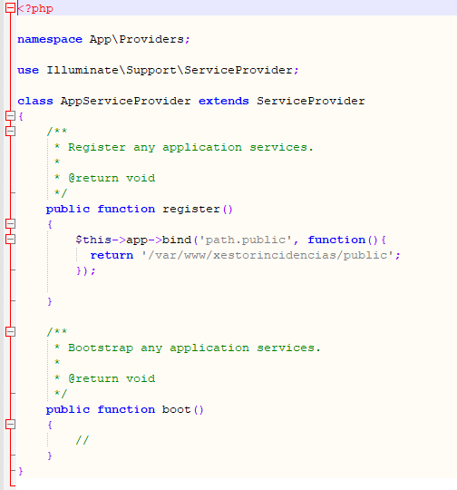
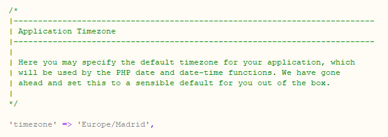
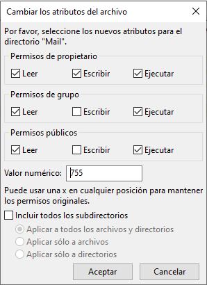
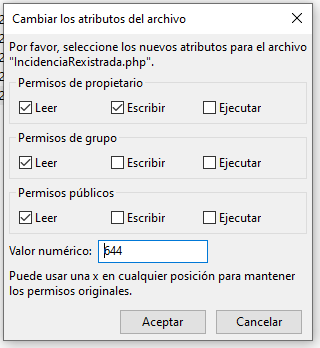

# 7. Implantación:

## Manual Técnico:

### **Información relativa á instalación:**

#### **Requirimentos do Sistema:**

* Requirimentos de Hardware: Para o despregue da aplicación necesitaremos un servidor web coas seguintes características:
    * CPU: 1 x Xeon-E2236 3.4GHz
    * Memoria RAM: 16GB
    * Disco duro: 2x1TB 

* Requirimentos de Software: O software necesario para despregar a aplicación será o seguinte: 
    * Sistema Operativo: Ubuntu Server 18.04.5 LTS (Ou superior)
    * Apache 2.4.29
    * MySQL 5.7.32
    * PHP 7.2.24
    * VSFTPD 3.0.3

#### **Preparación do sistema para a instalación da aplicación:**

Para a instalación da aplicación necesitaremos as seguintes configuracións previas no servidor:

- Precisaremos o acceso a unha base de datos (ou permisos para creala) para cargar a base de datos da aplicación.
- Precisaremos activar o mod_rewrite de Apache
- Precisaremos un directorio preparado en var/www para despregar a aplicación.
- Precisaremos ter acceso por FTP ao directorio designado para a aplicación.
- Precisaremos configurar un VirtualHost para acceder á nosa aplicación coa seguinte configuración mínima:

~~~
<VirtualHost *:80>

        ServerName proxectomms.sytes.net
        ServerAdmin webmaster@localhost
        DocumentRoot /var/www/xestorincidencias/public
        ErrorLog /var/www/xestorincidencias/error.log
        CustomLog /var/www/xestorincidencias/access.log combined

        <Directory /var/www/xestorincidencias>
                AllowOverride all
        </Directory>

</VirtualHost>
~~~

#### **Peparación da aplicación para o despregue:**

Para descargar a aplicación utilizaremos o seguinte enlace: [XESTORINCIDENCIAS.zip](../DESCARGABLES/XESTOR_INCIDENCIAS.zip)

Unha vez descargada a aplicación e antes de cargala no seu directorio é necesario realizar as seguintes configuracións:

- Arquivo .env:

    - Modificamos o entorno da aplicación para poñela en producción.
    - Desactivamos o modo DEBUG.
    - Indicamos a URL de acceso.
    - Configuramos o acceso á base de datos.
    - Configuramos o buzón para o envío de correos electónicos a través da aplicación. Para configurar correos de GMAIL pódese ver o seguinte [anexo](ANEXO_I_Config_mail_gmail.md)

- Arquivo app/Providers/AppServiceProvider.php:

    - Na función *register* engadimos o seguinte código:

    ~~~
        $this->app->bind('path.public', function(){
                return '/var/www/xestorincidencias/public';
        });
    ~~~

    Quedando da seguinte maneira:

    Desta forma actualizamos as rutas para que colla as asociadas ao aloxamento do servidor no que nos atopemos.

- Arquivo config/app.php:

    - Neste arquivo modificamos a zona horaria indicando na que estamos (no noso caso Europe/Madrid) se non indicamos a zona horaria correcta os rexistros da base de datos gardaranse coa hora na que estea esa zona horaria, tendo problemas cando, por exemplo, anunciamos a chegada ou finalización a unha incidencia.

Unha vez realizados estos cambios podemos cargar directamente tódolos arquivos da aplicación no directorio creado o despregue no servidor a través do servidor FTP.

#### **Permisos dos directorios LOG e Framework:**

Unha vez cargada a aplicación no servidor deberán de revisarse os permisos dos directorios storage/logs e storage/framework

Os permisos normais dos directorios para o funcionamento da aplicación son: 755

Os permisos normais dos arquivos para o funcionamento da aplicación son: 644

Os permisos destes directorios e dos directorios que conteñan deberán ser -> 775 (deberase permitir a lectura, escritura e execución ao grupo)

A maiores os arquivos do directorio storage/logs deberán ser ->664 (deberase permitir a lectura e execución ao grupo)

É necesario cambialos xa que é onde o framework garda os logs de erros e a caché do sistema para a optimización do funcionamento.

#### **Peparación da Base de Datos para o despregue:**

Descargaremos a base de datos do seguinte enlace: [dbxestorincidencias.sql](../DESCARGABLES/dbxestorincidencias.sql)

O arquivo descargado contén un script para cargar a base de datos. Dende a consola mysql do noso servidor, ou dende a interfaz gráfica que ofreza, cargamos o script importándoo ou copiándoo e quedará creada a estructura da base de datos.

A base de datos que se entrega está totalmente baleira, únicamente se xera un usuario administrador do sistema o cal se poderá modificar unha vez accedamos á aplicación. Para máis información sobre estos cambios consultar o [Manual de usuario](MANUAL_USUARIO/00_Introduccion.md).

Unha vez realizados estos cambios a aplicación estará xa funcional e accesible a través da url que teñamos preparada.

### **Información relativa á administración do sistema:**

***Copia de seguridade do sistema:***

No caso da instalación nun servidor propio é recomendable gardar unha imaxe de todo o sistema funcional de cara a, se nalgún momento se produce un desastre, poida devolverse o servizo no mínimo tempo posible.

***Copia de seguridade da aplicación:*** 

Unha vez a aplicación estea funcionando recoméndase realizar e almacenar unha copia de tódolos arquivos da aplicación cargados no servidor cos cambios que se realizaron para a sua configuración de xeito que, se por algún motivo se borra a aplicación teñamos unha copia preparada para cargar en calquera momento sen ter que volver modificar esos arquivos.

Non será necesario realizar copias periódicas dos arquivos da aplicación xa que estos só variarán cando se produzan modificacións ou melloras no código, de ser ese o caso deberá destruirse a copia antiga e gardar a nova.

***Copia de seguridade da Base de Datos;***

A base de datos é a parte máis importante da nosa aplicación, nela é onde se almacenan tódolos datos cos que traballamos, tódalas incidencias, usuarios,etc, recoméndanse facer copias de seguridade periódicas para evitar perdas indesexadas de datos.

A recomendación será realizar unha copia de seguridade diaria e ter almacenadas sempre as dúas últimas copias para maior seguridade.

***Xestión de erros e accesos non autorizados:***

Durante a configuración do VirtualHost configuramos os logs para ver os accesos e erros do noso servidor.

Deberan consultarse con certa asiduidade que non se estean a producir erros no error.log e, do mesmo xeito, que non se estean a producir intentos de acceso dende IP's extrañas.

Por outra banda, os erros da aplicación pódense consultar no seguinte directorio: /storage/logs/laravel.log.

### **Información relativa ao Mantemento do Sistema:**

Unha vez a aplicación está probada e en funcionamento comenzaremos co mantemento do sistema. Durante esta fase teremos tres puntos a considerar e a valorar:

- *Correcións de erros:* Realizaranse as correcións oportunas no producto entregado nun tempo razoable. Establecerase un prazo de 3 meses dende a posta en funcionamento do sistema durante o cal se correxirán os erros de codificación / funcionamento que se atopen sen que elo implique un custo de cara ao cliente.
A correción de erros está referida a erros que se atopen durante o funcionamento, non se contemplarán como erros posibles cambios de funcionalidades.

- *Adaptación por actualizacións:* A aplicación está basada no Framework Laravel, é altamente recomendable ir actualizando e adaptando a aplicación a novas versións do famework para evitar posibles vulnerabilidades no sistema, así como ila adaptando tamén a novas versións de PHP, MySQL. No caso de que se valore a realización de novas funcionalidades esta adaptación incluirase nesas novas funcionalidades.

- *Engadir Funcionalidades:* A aplicación desenvolta pode seguir en aumento coa posta en marcha de novas funcionalidades, módulos de facturación, conexión con outros servizos (Google Calendar, Google Maps...). Se o cliente o considera oportuno valorarase un mantemento que inclua novas funcionalidades.

O mantemento do sistema vai depender do producto adquirido polo cliente, se o cliente adquire a aplicación de modo gratuito non se contempla ningún tipo de mantemento.

No caso de que o cliente adquira a aplicación e desexe facer correcións, melloras, etc, valorarase en cada caso a mellor opción de mantemento.

### **Manual do usuario:**

Xunto con esta documentación atópase o [Manual de usuario](MANUAL_USUARIO/00_Introducion.md)

[->Voltar ao Incicio](../README.md)