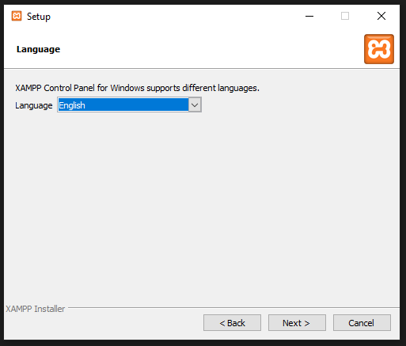

## Anexo II: Axudas Instalación Local

### Introdución: 

Para realizar as probas da aplicación nun ámbito local é necesario ter instalado un servidor local no noso PC.

Por outro lado é tamén recomendable cargar PHP como unha variable do entorno para poder (entre outras cousas) lanzar comandos PHP dende a consola do sistema.

Neste anexo explicaremos cómo realizar a instalación do servidor local XAMPP e como configurar PHP como unha variable do entorno en Windows 10.

### 1. Instalación de XAMPP en Windows 10:

Para realizar a instalación de XAMPP en Windows 10 realizaremos os seguintes pasos:

1. Descargamos XAMPP dende o seguinte enlace: https://www.apachefriends.org/es/download.html

Escollemos a versión que necesitemos. O proxecto require mínimo a versión 7.2.34 de PHP, polo que escolleremos unha versión que cumpla ese requisito:

2. Unha vez descargado executamos o instalable e comezamos a instalación. A primeira ventá que se abre indícanos que temos activado o Control de Contas de Usuario e podería haber cousas restrinxida. Simplemente dámoslle a OK e continuamos a instalación:

2. A continuación aparecerá unha ventá de Benvida, pulsamos en Next:

3. No paso seguinte mostrarásenos o listado de compoñentes a instalar. Para o noso cometido necesitaríamos únicamente Apache, MySQL, PHP e phpMyAdmin, pero por defecto deixámolos todos xa que nos pode servir nun futuro para probar ou desenvolver aplicacións que requiran outros paquetes:

4. A continuación pediranos o directorio de instalación, pódese cambiar sen problema, neste caso deixamos o que trae por defecto:

5. Logo pediranos a linguaxe para a instalación, escollemos English:

6. Na seguinte ventá daranos información sobre diferentes instaladores para poder instalar Wordpress, Drupal, etc. Desmarcamos a opción e continuamos:

7. Informaranos de que a aplicación está lista para instalarse, pulsamos en Next e comenzará a instalación:

8. Unha vez instalada executamos a aplicación. Cando a executamos por primeira vez saltarán avisos de Firewall de Windows para o servidor Apache e para MySQL. Permitimos o acceso nas redes privadas:

9. Unha vez aceptados os avisos abriramos o panel de control de xampp. Teremos que iniciar o servidor Apache e o servidor MySQL para que comece a funcionar:

Con esto teriamos o servidor local funcionando. Para probar que está correcto podemos acceder dende calquera navegador a http://localhost/ e veremos que nos mostra a páxina de información de XAMPP.

### 2. Configurar php en variable de entorno Windows 10:

Poder executar comandos php dende a consola de windows é moi interesante, sobre todo cando traballamos con frameworks tipo Laravel, que levan incorporada unha parte de consola que facilita todo o traballo de crear controladores, modelos, etc.

Para poder lanzar comandos php necesitamos configurar PHP como unha variable do entorno, para facelo seguiremos os seguintes pasos:

1. Accedemos ás propiedades do noso equipo: 

2. Abrirase unha ventá coas propiedades do equipo. Na columna esquerda seleccionamos *"Configuración avanzada del sistema"* e, na ventá que nos abre *"Variables de entorno..."*

3. Na ventá que se abre iremos á parte de *"Variables del sistema"*, seleccionaremos *"Path"* e faremos clic en "*Editar*":

4. Abrirase unha ventá para editar / engadir variables de entorno facemos clic en *"Nuevo"* e poderemos engadir a ruta a PHP. No caso do xampp que instalamos no punto anterior a ruta é C:\xampp\php

5. Aceptamos tódalas ventás para gardar os cambios e xa teremos a variable de entorno configurada. Para probar que todo foi ben podemos abrir a consola de windows e lanzar o seguinte comando *"php -v"*. Se todo está ben configurado devolveranos a versión de PHP que temos instalada:

