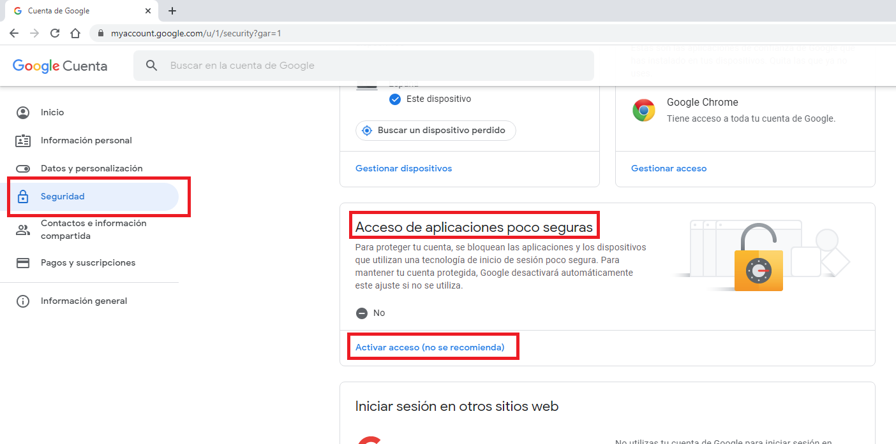

## ANEXO I: Configuración de GMAIL para enviar correos a través do Xestor de Incidencias

### Introdución:

A través da aplicación Xestor de Incidencias envíanse correos electrónicos automáticamente a distintas persoas durante todo o proceso de realización dunha incidencia. Vimos no apartado de implantación que é posible utilizar calquera correo electrónico configurándoo previamente no arquivo .env da aplicación.

No caso de querer enviar correos electrónicos a través dunha consta de GMAIL hai que realizar unhas configuracións na conta previamente.

Neste manual imos ver como configurar a conta de GMAIL.

### 1 . Habilitar o acceso a aplicacións pouco seguras:

Este é o primeiro que debemos facer, para elo realizamos o seguinte procedento:

1. Iniciamos sesión en Gmail coa conta de correo electrónico que queremos utilizar. Despregamos as opcións da conta e accedemos a *"Gestionar tu cuenta de Google"*:

2. Na ventá que se abre facemos clic en *"Seguridad"* e baixamos hasta atopar a opción *"Acceso de aplicaciones poco seguras"* que estará desactivado

3. Pulsamos en *"Activar acceso (no se recomienda)"* e abrirase unha ventá para habilitar o acceso. Activámolo.

### 2. Habilitar a autenticación en dous pasos:

A continuación deberemos habilitar a autenticación en dous pasos na nosa conta de Gmail. Este tipo de autenticación é recomendable ainda que non sexa para esta aplicación en concreto xa que, a maiores do contrasinal da conta de Gmail solicita outro modo de autenticación adicional.

Para habilitar a autenticación en dous pasos realizamos o seguinte:

1. Accedemos ao seguinte enlace: https://www.google.com/landing/2step/

2. Facemos clic en *"Empieza"* e abrirase unha nova ventá. Facemos clic en *"Empezar"*:

3. Abrirase unha ventá para iniciar sesión no correo no que queremos habilitar a verificación en dous pasos. Inciamos sesión.

4. Pediranos configurar o teléfono que utilizaremos para realizar a validación, configurámolo e marcamos unha das opcións para obter un código para verificar aopción que queiramos (neste caso marcamos *"Mensaje de Texto"*) e facemos clic en *"Siguiente"*.

5. Na ventá que se abre introducimos o código que recibimos e facemos clic en *"Siguiente"*.

6. Se todo foi ben pediranos a confirmación para activar a verificación en dous pasos, facemos clic en *"Activar"*.

7. Informaranos de que a verificación está activada e mostrará máis configuracións que, para este caso, non vamos profundizar xa que non son necesarias:

### 3. Xeración da clave para a aplicación Xestor de Incidencias:

Por último, no que a Gmail se refire, queda autorizar á nosa aplicación para utilizar o correo electrónico.

1. Facemos clic no seguinte enlace: https://security.google.com/settings/security/apppasswords

2. Iniciamos sesión coa conta de Gmail que utilizaremos na aplicación:

3. Na ventá que se abre seleccionamos en *"Seleccionar aplicación -> Otra (nombre personalizado)"*.

4. Poñémoslle un nome á aplicación e facemos clic en *"Generar"*.

5. Xera o contrasinal que teremos que copiar e pegar no noso arquivo .env para poder enviar correos electrónicos.

6. Facemos clic en *"Listo"* e, con eso, Gmail estaría preparado para enviar correos electrónicos dende a nosa aplicación.

Quedaría únicamente modificar na nosa aplicación o arquivo .env como se explicou na parte de implantación, na parte do arquivo sobre a configuración de MAIL configurámola da seguinte maneira:

Gardamos e a aplicación xa enviará correos electrónicos.
