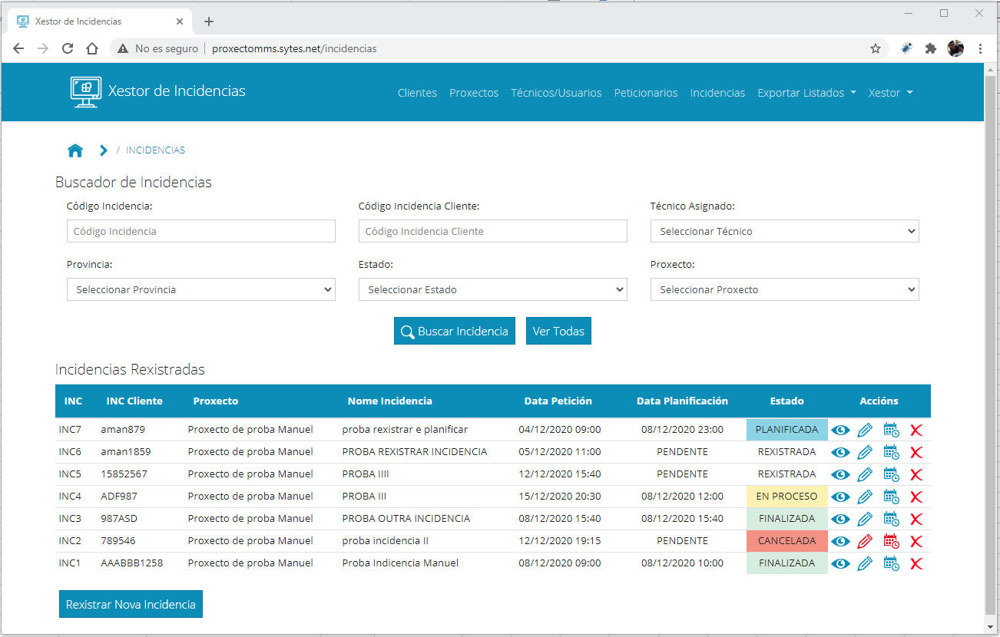

## MANUAL DE USUARIO XESTOR DE INCIDENCIAS

### Índice:

* [00 - Introdución](00_Introducion.md)
* [01 - Acceso á aplicación](01_Acceso.md)
* [02 - Xestión de usuarios](02_Xestion_usuarios.md)
* [03 - Xestión de clientes](03_Xestion_clientes.md)
* [04 - Xestión de proxectos](04_Xestion_proxectos.md)
* [05 - Xestión de peticionarios](05_Xestion_peticionarios.md)
* [06 - Xestión de incidencias](06_Xestion_incidencias.md)
* [07 - Exportación de listados](07_Exportar_listados.md)

### Introdución:

O presente documento ten por función explicar o funcionamento da aplicación Xestor de Incidencias. 
A aplicación está deseñada para aquelas empresas que se adiquen a realizar traballos para terceiros (subcontratados), aínda que, dado o seu deseño, pódense albergar outro tipo de traballos.
A aplicación permite ter dous tipos de usuarios, por unha parte está o usuario ADMNISTRADOR, é o encargado de dar de alta (ou borrar) clientes, proxectos, técnicos,  incidencias e peticionarios, e poderá tamén descargar distintos listados en formato de follas de cálculo para facer outros estudos que considere oportunos e que, polo momento, non están dispoñibles na aplicación.
Por outra parte está o usuario TÉCNICO, este usuario únicamente ten permiso para ver as incidencias que ten planificadas no mesmo día e poder ir informando (de maneira rápida e sinxela) do estado da incidencia en cada momento. 
Para unha mellor comprensión de todo o procedemento comezaremos explicando como acceder á aplicación e como xestionar usuarios e logo explicaremos todo o proceso a seguir dende que un cliente se pon en contacto connosco para realizar un proxecto ata a finalización da incidencia.
Antes de comezar comentar que as claves por defecto unha vez seguido o procedemento de instalación son as seguintes:

Usuario: admin@xestorincidencias.com

Password: abc123..

[->Continuar a "01_Accedendo á aplicación"](01_Acceso.md)