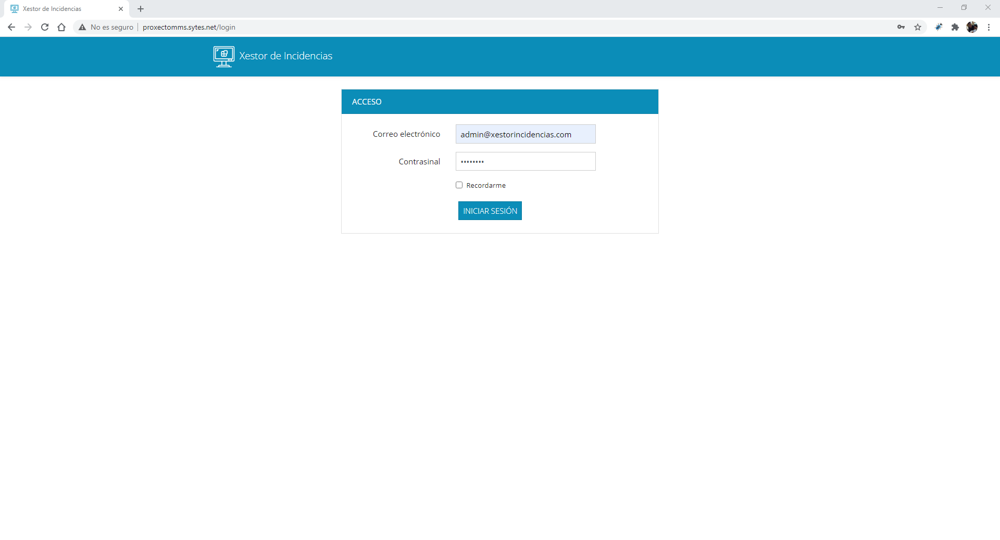
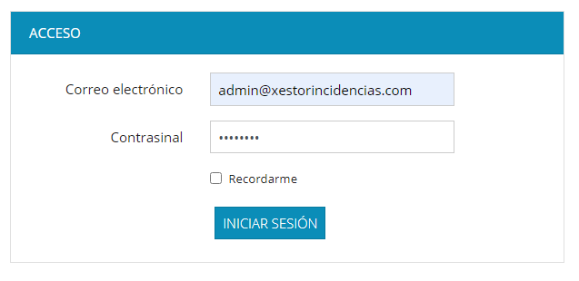
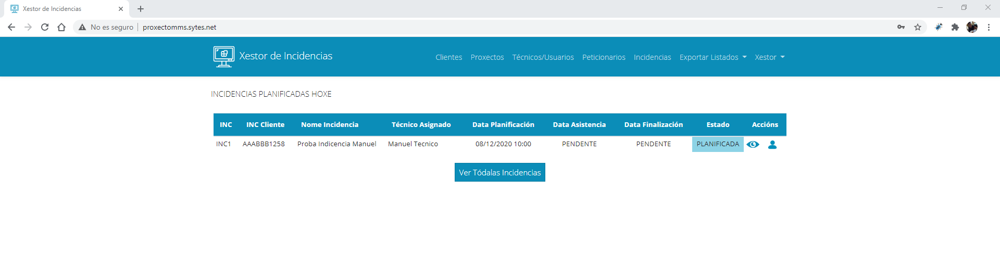
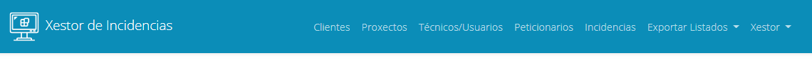

### 1. Accedendo á aplicación:

O primeiro paso é acceder á aplicación, para elo terás despregada a mesma nalgún servidor, terás que acceder dende un navegador á URL da túa aplicación. Neste caso a URL onde está despregada é: http://proxectomms.sytes.net
Ao acceder á url aparecerá unha ventá de login onde se solicitará un correo electrónico e unha contrasinal, accedemos coas claves que deixamos por defecto:

Unha vez iniciada sesión accederemos á páxina de inicio na que veremos as incidencias que están planificadas para o día actual. O usuario administrador verá as incidencias de tódolos técnicos e os técnicos só verán as súas.

Na parte superior da ventá aparece un menú no que se verán tódalas opcións dispoñibles, este menú varía en función das opcións que teña cada usuario, é dicir, un usuario administrador verá tódalas opcións, un usuario técnico non verá ningunha xa que só ten acceso á páxina de inicio.

Iremos vendo as opcións a medida que avanzamos.

[->Continuar a "02_Xestión de Técnicos / Usuarios"](02_Xestion_usuarios.md)
