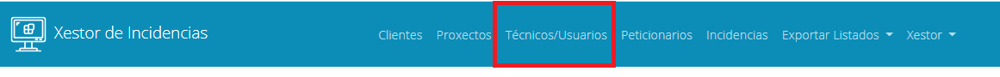

### 2. Xestión de Técnicos / Usuarios

Imos ver a continuación a xestión de usuarios para cambiar os datos de administrador e crear novos usuarios. Para elo, dentro do menú superior accedemos á opción Técnicos/Usuarios:

Abrirase unha ventá na que se mostrarán tódolos usuarios do sistema. 

Na parte superior veremos un buscador de usuarios no que podemos filtrar por un ou varios campos. Non é necesario que se cubra o nome completo no buscador, basta con escribir parte.
Imos buscar o noso usuario, cubrimos polos campos que queremos buscar, e pulsamos en buscar:

Vemos que hai dous usuarios con nome Xestor, pero só hai un que o Primeiro apelido sexa Incidencias, deberá aparecer só ese usuario:

En cada usuario temos tres botóns, un para ver, outro para modificar e outro para eliminar o usuario. 

Imos explicar cada un deles:

Botón ver: 

Ao pulsar sobre el abrirase unha ventá coa información do usuario. Nesa ventá non poderemos modificar ningún campo.

Botón Modificar: 

Ao pulsar sobre el abrirase unha ventá para modificar os datos do usuario. Nesa ventá poderemos cambiar tanto os datos persoais como o rol de acceso do usuario e o contrasinal. No noso caso imos cambiar o contrasinal de acceso:

Unha vez que lle damos a Modificar aparecerá unha mensaxe indicando que o cambio foi satisfactorio:

Por último temos o botón de eliminar:

Ese botón abrirá unha ventá para confirmar que realmente queremos eliminar o usuario. Un usuario só se poderá eliminar no caso de que non teña incidencias asignadas, noutro caso dará erro:

Unha vez eliminado o usuario desaparece da táboa de resultados e aparece unha mensaxe de éxito:

Por último, no que a xestión de usuarios se refire, poderemos crear novos usuarios. Para elo, debaixo da táboa de resultados temos un botón de Engadir Novo Usuario: 

Pulsando sobre el abrirase un formulario para crear un novo usuario:

Unha vez cuberto e tras pulsar o botón enviar, se todo foi ben aparecerá unha mensaxe indicando que o usuario quedou rexistrado e aparecerá o usuario na táboa de usuarios, hai que prestar especial atención a escoller o rol adecuado:

ADMINISTRADOR -> ACCESO A TODO O SISTEMA

TÉCNICO->ACCESO SÓ ÁS SÚAS INCIDENCIAS PLANIFICADAS

Con isto estarían tódalas operacións con usuarios.

[->Continuar a "03_Xestión de Clientes"](03_Xestion_clientes.md)