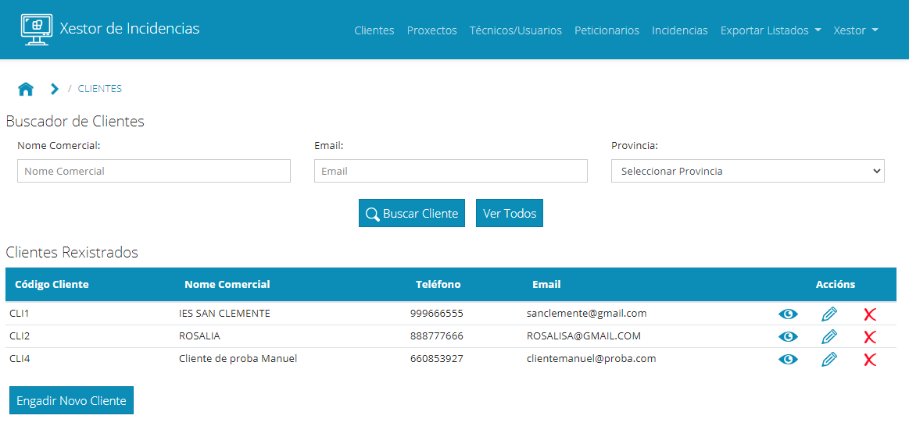
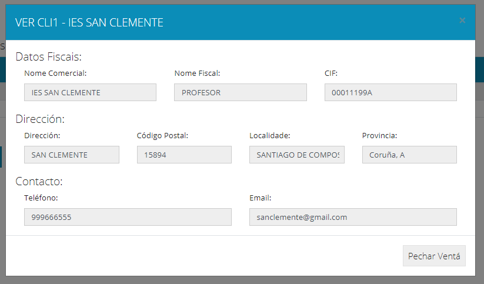
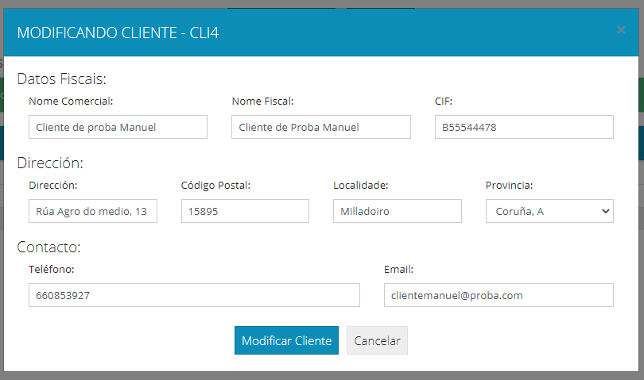
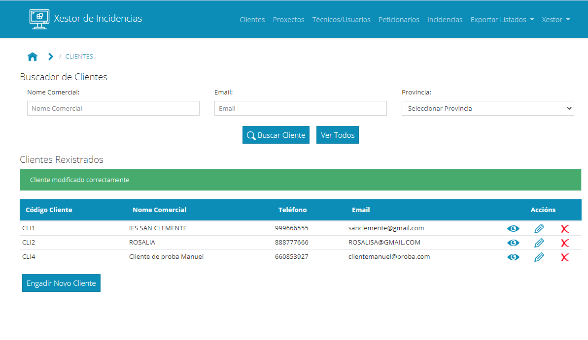
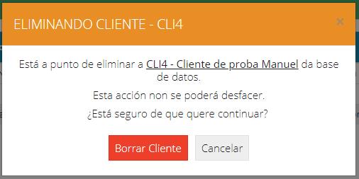
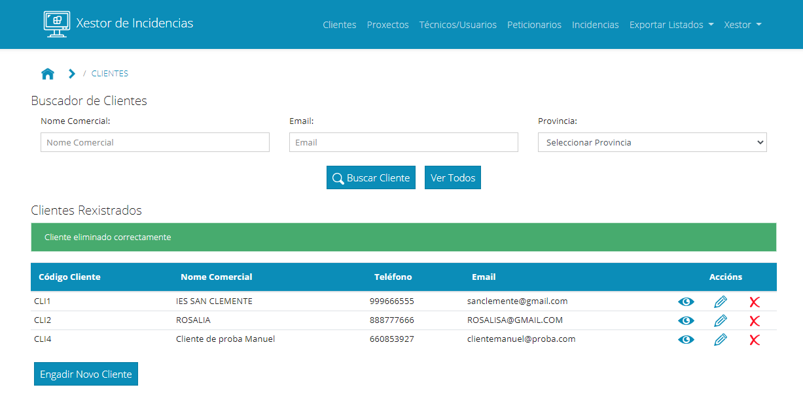
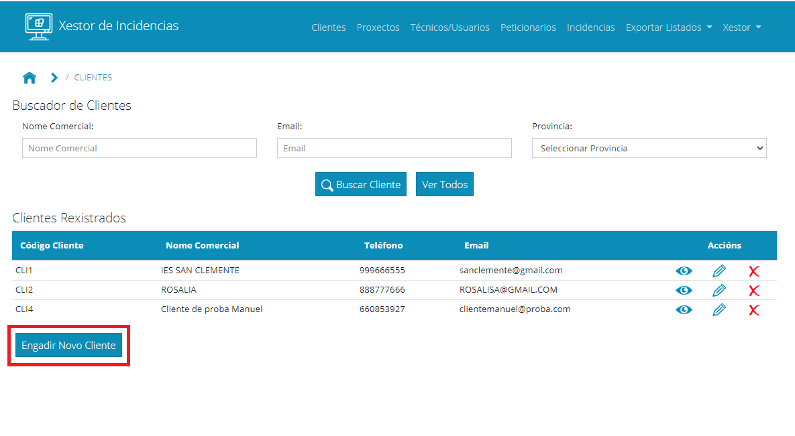
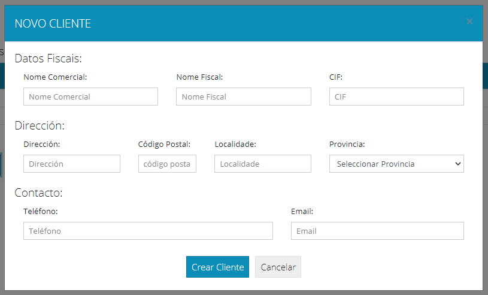
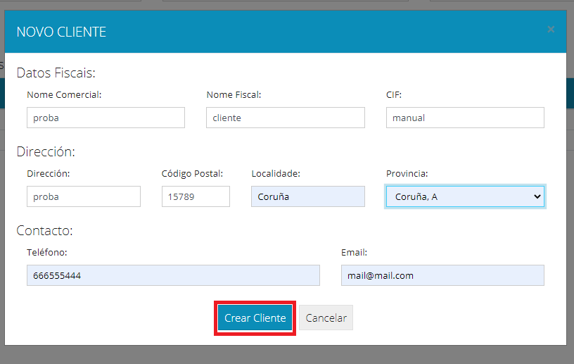
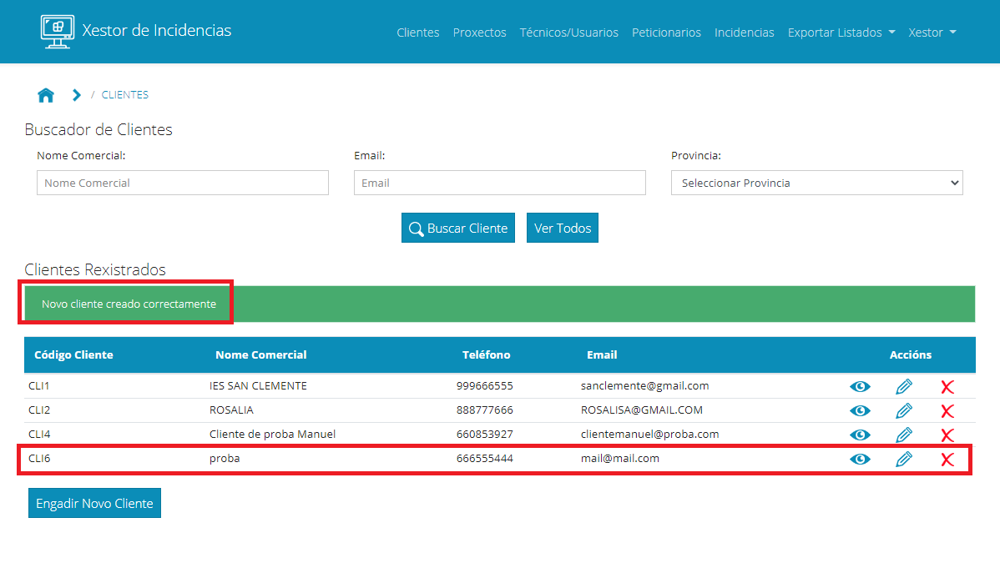

### 3. Xestión de Clientes

Continuamos explicando como xestionar os clientes na aplicación. Para acceder á xestión de clientes, no menú superior accedemos ao enlace Clientes:

Levaranos a unha ventá na que aparecerá na parte superior un buscador no que poderemos filtrar por un ou varios campos para localizar a un cliente. Na parte inferior aparecerá un listado de clientes creados:

En cada cliente teremos tres botóns para ver, modificar ou eliminar o cliente.

Imos explicar cada un deles:

Botón ver: 

Abrirá unha ventá na que aparecerán os datos do cliente. Nesa ventá non se poderán modificar:

Botón Modificar: 

Ao pulsar sobre el abrirase unha ventá para modificar os datos do cliente. 

Unha vez cambiado o necesario, e pulsado Modificar, se todo foi ben aparecerá unha mensaxe de éxito e os datos cambiados na táboa de resultados:

Eliminar:

Ese botón abrirá unha ventá para confirmar que realmente queremos eliminar o cliente. Un cliente só se poderá eliminar no caso de que non teña proxectos asignados, noutro caso dará erro:

Se se puido eliminar mostrará unha mensaxe de éxito:

Por último, no que a xestión de clientes se refire, poderemos crear novos clientes. Para elo, debaixo da táboa de resultados temos un botón de Engadir Novo Cliente: 

Pulsando sobre el abrirase un formulario para crear un novo cliente:

Unha vez cuberto e tras pulsar o botón enviar, se todo foi ben aparecerá unha mensaxe indicando que o cliente quedou rexistrado e aparecerá o cliente na táboa de clientes:

Con isto estarían tódalas operacións con clientes.

[->Continuar a "04_Xestión de Proxectos"](04_Xestion_proxectos.md)