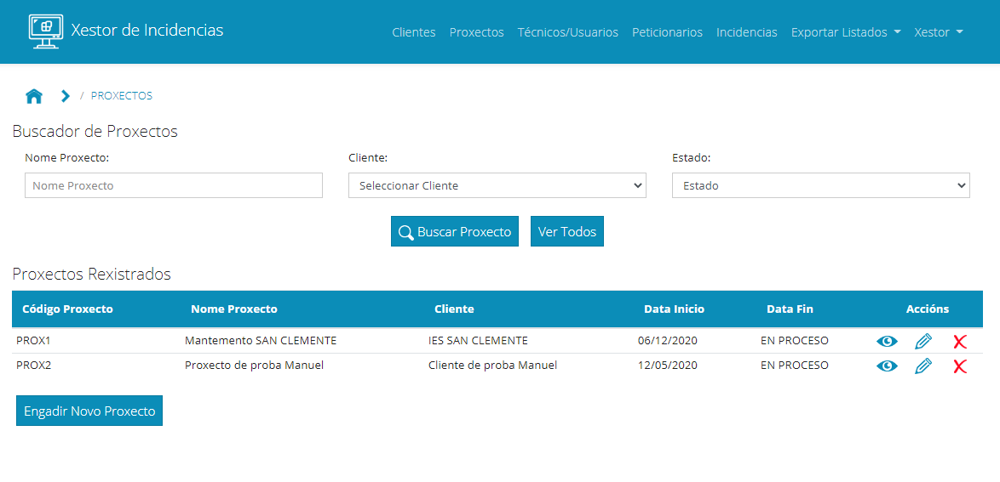
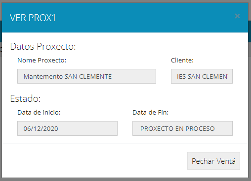
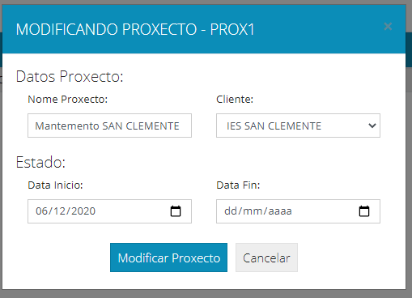
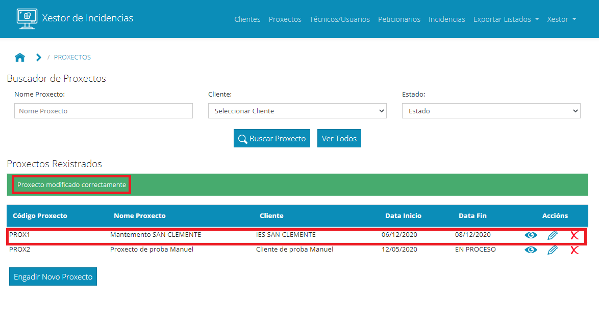
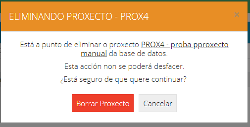
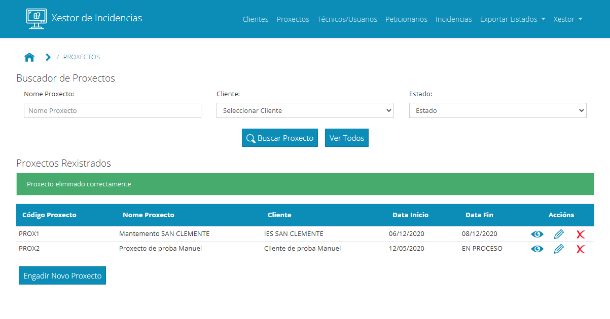
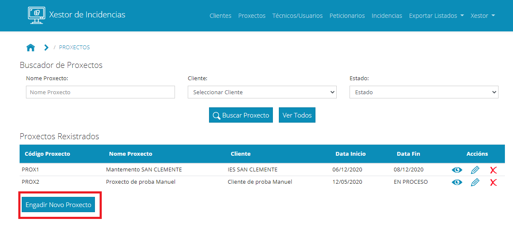
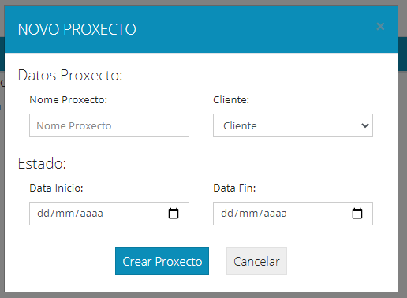
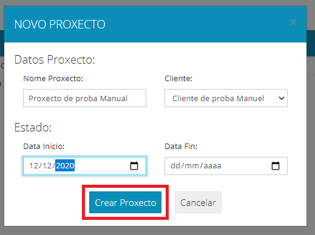
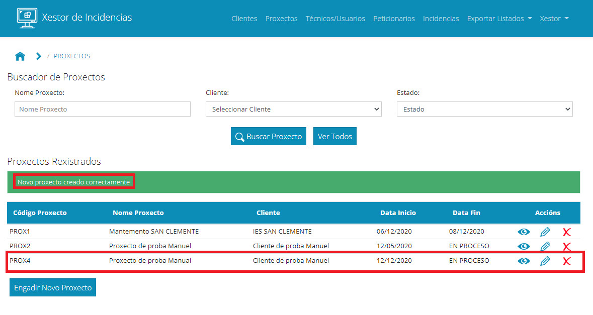

### 4. Xestión de Proxectos

Continuamos explicando como xestionar os proxectos na aplicación. Para acceder á xestión de proxectos, no menú superior accedemos ao enlace Proxectos:

Levaranos a unha ventá na que aparecerá na parte superior un buscador no que poderemos filtrar por un ou varios campos para localizar un proxecto. Na parte inferior aparecerá un listado de proxectos creados:

En cada proxecto teremos tres botóns para ver, modificar ou eliminar o proxecto.

Imos explicar cada un deles:

Botón ver: 

Abrirá unha ventá na que aparecerán os datos do proxecto. Nesa ventá non se poderán modificar:

Botón Modificar: 

Ao pulsar sobre el abrirase unha ventá para modificar os datos do proxecto. 

Unha vez cambiado o necesario, e pulsado Modificar, se todo foi ben aparecerá unha mensaxe de éxito e os datos cambiados na táboa de resultados:

Eliminar:

Ese botón abrirá unha ventá para confirmar que realmente queremos eliminar o proxecto. Un proxecto só se poderá eliminar no caso de que non teña incidencias asignadas, noutro caso dará erro:

Se se puido eliminar mostrará unha mensaxe de éxito e o proxecto desaparecerá do listado:

Por último, no que a xestión de proxectos se refire, poderemos crear novos proxectos. Para elo, debaixo da táboa de resultados temos un botón de Engadir Novo Proxecto:

Pulsando sobre el abrirase un formulario para crear un novo proxecto:

Unha vez cuberto e tras pulsar o botón enviar, se todo foi ben aparecerá unha mensaxe indicando que o proxecto quedou rexistrado e aparecerá o proxecto na táboa de proxectos:

Con isto estarían tódalas operacións con proxectos.

[->Continuar a "05_Xestión de Peticionarios"](05_Xestion_peticionarios.md)