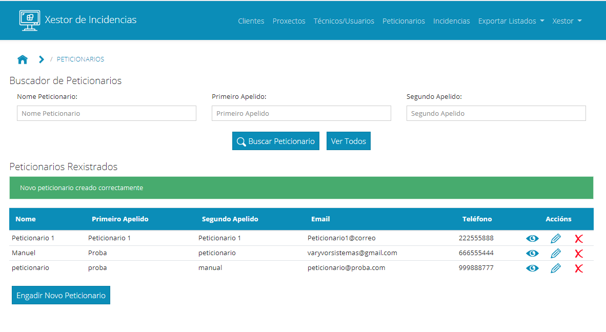

### 5. Xestión de Peticionarios

Continuamos explicando como xestionar os peticionarios na aplicación. Para acceder á xestión de peticionarios, no menú superior accedemos ao enlace Peticionarios:

Levaranos a unha ventá na que aparecerá na parte superior un buscador no que poderemos filtrar por un ou varios campos para localizar un peticionario. Na parte inferior aparecerá un listado de peticionarios creados:

En cada peticionario teremos tres botóns para ver, modificar ou eliminar o peticionario.

Imos explicar cada un deles:

Botón ver: 

Abrirá unha ventá na que aparecerán os datos do peticionario. Nesa ventá non se poderán modificar:

Botón Modificar: 

Ao pulsar sobre el abrirase unha ventá para modificar os datos do peticionario.  

Unha vez cambiado o necesario, e pulsado Modificar, se todo foi ben aparecerá unha mensaxe de éxito e os datos cambiados na táboa de resultados:

Eliminar:

Ese botón abrirá unha ventá para confirmar que realmente queremos eliminar o peticionario. Un peticionario só se poderá eliminar no caso de que non teña incidencias asignadas, noutro caso dará erro:

Se se puido eliminar mostrará unha mensaxe de éxito e o peticionario desaparecerá do listado:

Por último, no que a xestión de peticionarios se refire, poderemos crear novos peticionarios. Para elo, debaixo da táboa de resultados temos un botón de Engadir Novo Peticionario: 

Pulsando sobre el abrirase un formulario para crear un novo peticionario:

Unha vez cuberto e tras pulsar o botón crear, se todo foi ben aparecerá unha mensaxe indicando que o peticionario quedou rexistrado e aparecerá o peticionario na táboa de peticionarios:

Con isto estarían tódalas operacións con peticionarios.

[->Continuar a "06_Xestión de Incidencias"](06_Xestion_incidencias.md)