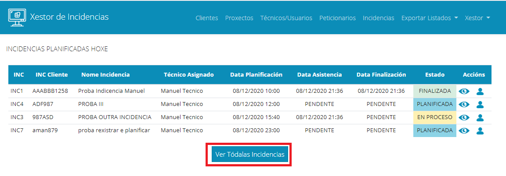

### 6. Xestión de Incidencias

Continuamos explicando como xestionar as incidencias na aplicación. Para acceder á xestión de incidencias, no menú superior accedemos ao enlace Incidencias:

Levaranos a unha ventá na que aparecerá na parte superior un buscador no que poderemos filtrar por un ou varios campos para localizar unha incidencia. Na parte inferior aparecerá un listado de incidencias creadas. 

O campo estado das incidencias estará en diferentes cores en función do estado no que se atope a incidencia. 

En cada peticionario incidencia teremos os seguintes botóns:

Botón ver:

Abrirá unha ventá na que aparecerán os datos da incidencia. Nesa ventá non se poderán modificar:

No fondo da ventá poderemos ver un histórico dos estados polos que pasou a incidencia.

Botón Modificar:

Ao pulsar sobre el abrirase unha ventá para modificar os datos da incidencia. Os datos que poderemos modificar dende aquí refírense a datos do proxecto, descricións da incidencia e datos de asistencia, non modificaremos dende aquí a planificación:

Unha vez que fagamos os cambios oportunos e pulsemos en Modificar incidencia, se todo foi ben aparecerá unha mensaxe de éxito:

Botón Modificar ou engadir planificación:

Ao pulsar sobre este botón abrirase unha ventá para engadir ou modificar a planificación da incidencia:

Unha vez cambiado o necesario, e pulsado Planificar, se todo foi ben aparecerá unha mensaxe de éxito e os datos cambiados na táboa de resultados:

A maiores, ao variar a planificación ou planificar unha incidencia chegaralle un correo electrónico tanto ao peticionario da incidencia como ao técnico que asistirá indicando a planificación da incidencia:

Botón Cancelar Incidencia:

Este botón permitirá cancelar unha incidencia. Unha vez pulsado abrirase unha ventá para confirmar que realmente queremos cancelar a incidencia.

Se aceptamos a cancelación a incidencia cancelarase, a data de planificación (no caso de que a tivera) borrarase, e os botóns para modificar ou replanificar a incidencia deshabilitaranse. Ademáis enviarase un correo electrónico ao peticionario da incidencia indicando a cancelación:

Por último, no que a xestión de incidencias se refire, poderemos crear novas incidencias. Para elo, debaixo da táboa de resultados temos un botón de Rexistrar Nova Incidencia: 

Pulsando sobre el abrirase un formulario para crear unha nova incidencia:

Con respecto a esta ventá mencionar que con respecto aos proxectos aparecerán só os proxectos que non estean finalizados. 

Unha vez teñamos tódolos datos da incidencia cubertos premeremos no botón Rexistrar Incidencia. Nese momento rexistrarase a incidencia, voltaremos ao listado de incidencias, a incidencia márcase como rexistrada e enviarase un mail ao peticionario conforme a incidencia foi rexistrada.

## VENTÁ INICIO USUARIO ADMINISTRADOR

A esta ventá accédese Pulsando sobre o logo da aplicación. É a mesma ventá que vemos ao iniciar sesión. 

Nesta ventá veremos tódalas incidencias planificadas para o día actual:

Dende ela podemos ir vendo o avance da incidencia a medida que o técnico vai marcando as súas chegadas, temos ademáis un botón para ver a incidencia e outro para ver os datos do técnico que asiste, deste xeito témolos accesibles de forma sinxela:

Botón ver incidencia:

Mostrará unha ventá con tódolos datos da incidencia:

Botón ver datos técnico:

Mostra unha ventá cos datos do técnico asistente:

Ademáis temos un botón para acceder á ventá de xestión de incidencias:

## VENTÁ INICIO USUARIO TÉCNICO

Cando un técnico entra na aplicación esta será a ventá que ve:

Mostraranse as incidencias que ten planificadas. Terá tres botóns en cada incidencia:

Botón ver incidencia:

Mostrará unha ventá con tódolos datos da incidencia:

Botón anunciar chegada:

Ao premer sobre el mostrarase unha mensaxe para confirmar que se quere anunciar a chegada:

Se prememos en anunciar chegada mostrarase unha mensaxe conforme se notificou correctamente, deshabilitarase o botón para non poder anunciala de novo e enviarase un email ao peticionario indicando que o técnico xa está na incidencia. Ademáis o administrador verá a incidencia como EN PROCESO:

Botón anunciar Finalización:

Unha vez que o técnico remate a incidencia deberá premer ese botón para anunciar a súa finalización. Unha vez o prema aparecerá unha mensaxe para confirmar que realmente se quere anunciar a finalización:

Se continúa confirmarase a finalización, o botón deshabilitarase, enviarase un correo electrónico ao peticionario indicando que a incidencia está finalizada e na ventá do usuario administrador aparecerá tamén como finalizada:

[->Continuar a "07_Exportación de Listados"](07_Exportar_listados.md)