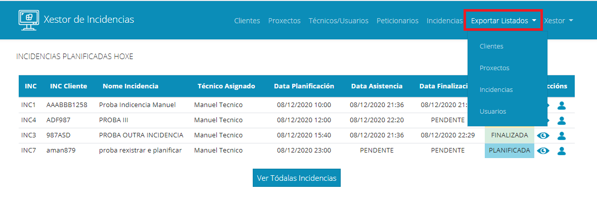
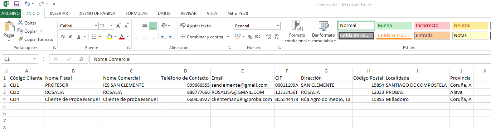
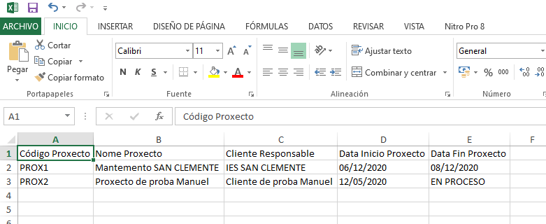
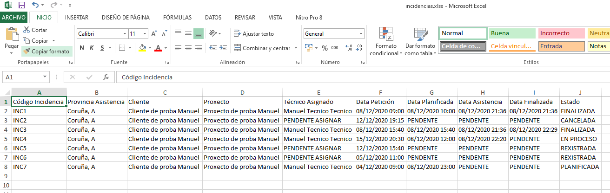
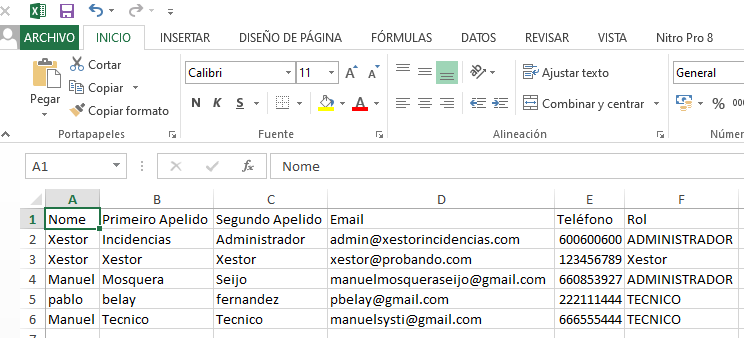

### 7. Exportación de Listados

Por último, a través da aplicación, o usuario administrador poderá descargar os seguintes listados en formato .xlsx. Para elo, dende o menú superior, pode acceder ao enlace Exportar Listados:

Dende ahí ten accesibles os seguintes listados:

* Listado de clientes: Descarga un arquivo cos datos de tódolos clientes

* Listado Proxectos: Descarga un arquivo cos datos de tódolos proxectos

* Listado de Incidencias: Mostra un arquivo cos datos de tódalas incidencias

* Listado de Usuarios: Mostra un arquivo cos datos de tódolos usuarios

[->Voltar ao Incicio](../../README.md)