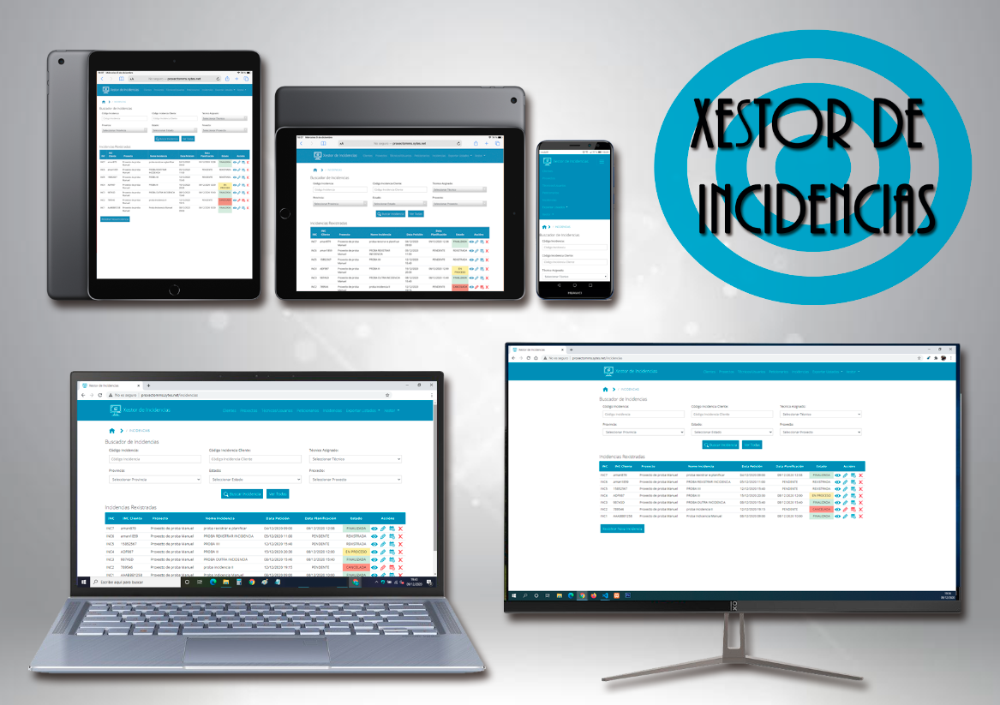
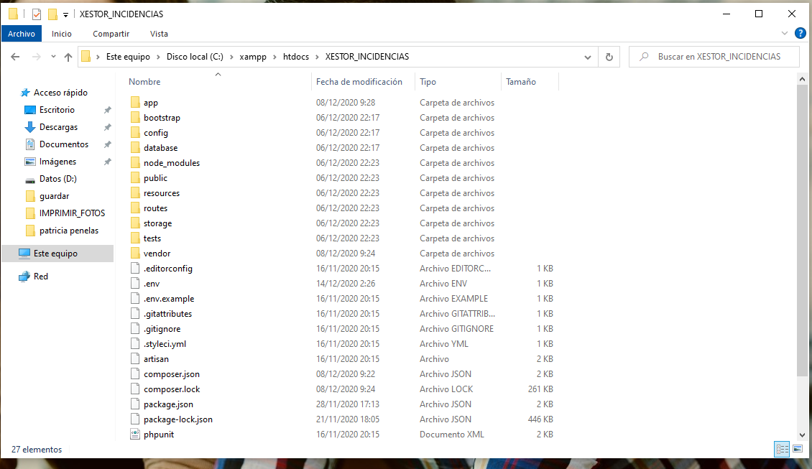
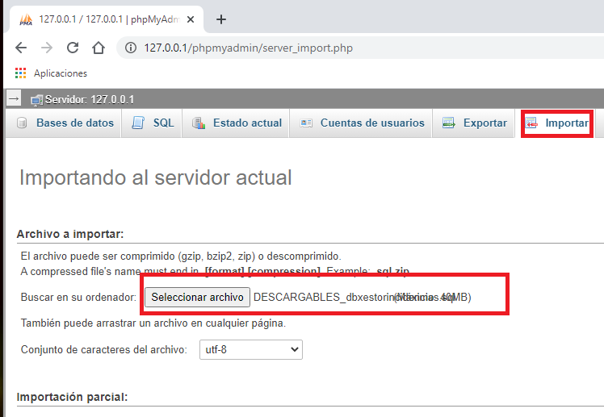
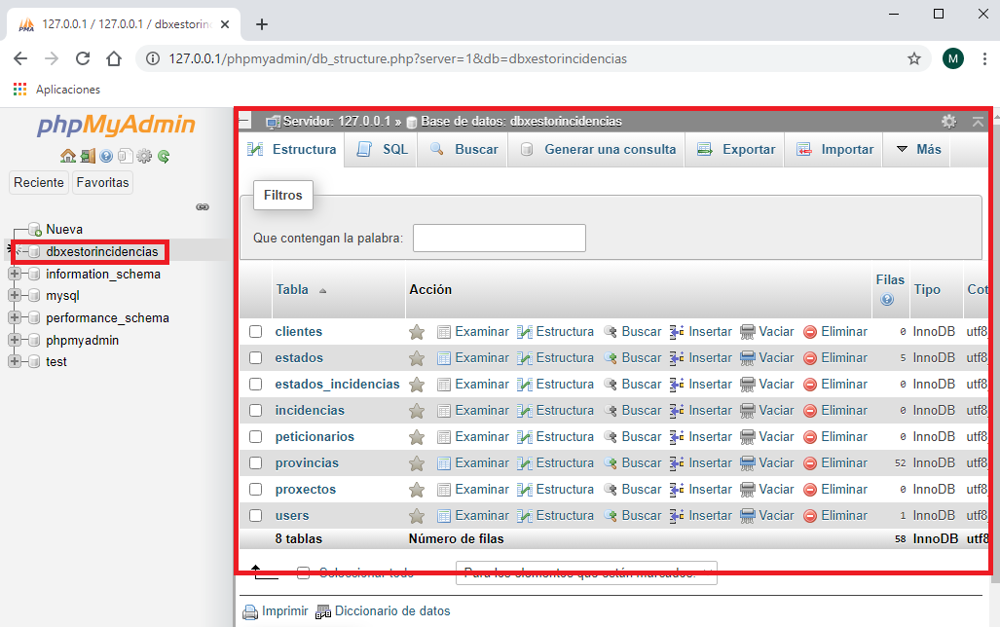
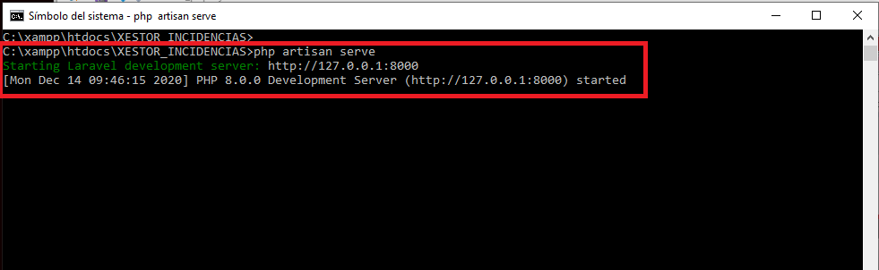
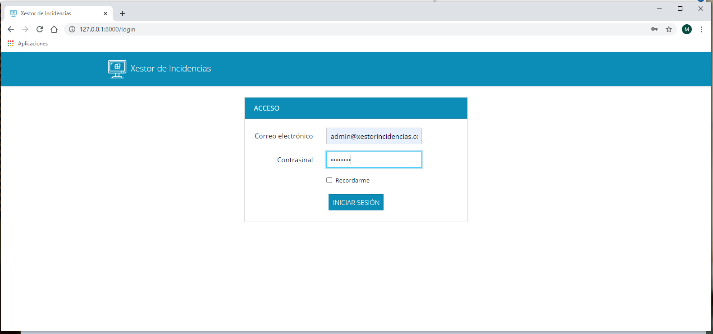
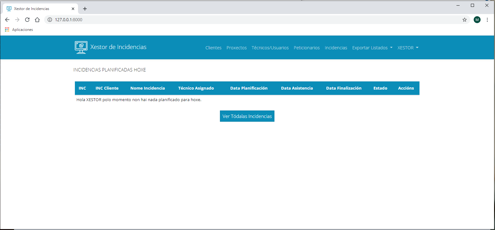

# Proxecto Fin de Ciclo - Xestor de incidencias

## Descrición

O traballo que vou levar a cabo como proxecto de fin de ciclo vai ser o desenvolvemento dunha pequena aplicación web para xestionar incidencias e traballos dunha determinada empresa.

Durante a miña vida profesional levo traballado para pequenas empresas que se adican a realizar traballos (intervencións) subcontratadas por outras empresas máis grandes. Na maioría dos casos estas pequenas empresas utilizaban unha folla de cálculo para almacenar os datos dos traballos que realizaban cos inconvintes que iso supuña (repetición de datos, só tiña acceso unha persoa, quedaban cousas a medias...).

Deste modo xurdiu a idea de realizar esta aplicación, crear unha ferramenta que sirva para almacenar todos os datos de maneira sinxela, que as diferentes persoas involucradas dentro da empresa teñan acceso aos datos que lle interesan, e incluso que permita a automatización de tarefas como o envío de emails ás partes interesadas a medida que se vai avanzando na solución dunha intervención.

Durante a realización do proxecto aproveitaremos para aprender a utilizar o Framework Laravel, un dos frameworks máis famosos e utilizado de PHP, Bootstrap, JQuery e complementar así os coñecementos adquiridos ao longo de todo o ciclo con tecnoloxías moi demandadas no mundo laboral.

Pódese acceder á versión demo da aplicación no seguinte enlace: http://proxectomms.sytes.net

Pódese ver ou descargar un vídeo demostrativo do funcionamento da aplicación premendo no seguinte [enlace](http://proxectomms.sytes.net/video_demo/APP_Xestor_Incidencias.mp4)

**Nota:** O enlace da aplicación e o vídeo demostrativo estarán dispoñibles ata o 18/12/2020 ás 13:00. Se necesita unha copia non dude en descargala ou póñase en contacto comigo a través do contacto proporcionado na sección "Contacto" do presente documento.

## Instalación / Posta en marcha

Para a posta en marcha da aplicación nun entorno local partiremos de que temos instalado e funcionando un servidor local XAMPP no noso equipo e configurado php como variable de entorno de windows. Se hai algunha dúbida sobre como realizar este procedemento adxúntase o seguinte [ANEXO](DOCUMENTACION_PROXECTO/ANEXO_II_Axudas_Instalacion_Local.md) onde se indican os pasos necesarios para a preparación do entorno local.

Para a instalación da aplicación en local descargaremos tanto o código da nosa aplicación como o script da creación da base de datos. Para elo deixamos unha carpeta de Descargables que contén:

- [XESTOR_INCIDENCIAS.zip](DESCARGABLES/XESTOR_INCIDENCIAS.zip) : Contén o código da aplicación.

- [dbxestorincidencias.sql](DESCARGABLES/dbxestorincidencias.sql) : Contén o Script da creación da base de datos.

Unha vez descargados os arquivos no equipo descomprimiremos o código da aplicación na carpeta HTDOCS do noso servidor local XAMPP:

Por outro lado, accederemos ao PHPMyAdmin do noso servidor local e importaremos o arquivo dbxestorincidencias.sql para crear a base de datos.

Unha vez realizadas estas accións, dende a consola de windows accedemos ao directorio onde descargamos o código da aplicación (c:/xampp/htdocs/XESTOR_INCIDENCIAS) e lanzamos o seguinte comando: *"php artisan serve"* esto activaranos o servidor para poder probar a aplicación.

Se accedemos dende calquera navegador á URL que nos mostra a consola de windows veremos que poderemos acceder á aplicación.

As credenciais por defecto son:

email: admin@xestorincidencias.com

password: abc123..

Para dúbidas sobre o funcionamento pódese revisar o [Manual de Usuario](DOCUMENTACION_PROXECTO/MANUAL_USUARIO/00_Introduccion.md)

**NOTA:** O paquete descargable ven preparado para instalar nun servidor local no que o acceso á base de datos se realiza co usuario root e sen contrasinal, no caso de que teñamos configurado algún contrasinal ou un usuario distinto deberemos modificar o arquivo .env cos datos de acceso. Se hai dúbidas de como realizar este procedento podemos revisar o apartado *"Preparacion da aplicación para o despregue -> Arquivo.env"* do documento de [Implantación](DOCUMENTACION_PROXECTO/07_Implantacion.md)

**NOTA 2:** Para o envío de emails dende a aplicación creouse unha conta de correo de gmail que estará dispoñible ata o día 18/12/2020 ás 13:00, chegado ese momento esa conta de correo eliminarase. Para cambiar a conta de correo podemos revisar o apartado *"Preparación da aplicación para o despregue -> Arquivo.env"* do documento de [Implantación](DOCUMENTACION_PROXECTO/07_Implantacion.md) e o seguinte [anexo](DOCUMENTACION_PROXECTO/ANEXO_I_Config_mail_gmail.md)

**NOTA 3:** Deixamos tamén dispoñible un enlace no que se pode probar a aplicación online se se desexa: http://proxectomms.sytes.net O acceso realízase coas credenciais por defecto. Este enlace estará dispoñible ata o día 18/12/2020 ás 13:00.

## Uso

A aplicación Xestor de Incidencias conta cunha interfaz gráfica dende a que se poden realizar as seguintes funcións:

- Listado de usuarios, clientes, proxectos, peticionarios e incidencias. En cada unha das seccións aparecerá un buscador que permite filtrar por diferentes campos para obter os resultados necesarios.
- Para o rexistro e modificación de datos farase uso de diferentes ventás modais que permitan a inclusión de tódolos campos.
- Para a visualización de datos farase uso tamén de diferentes ventás modais nas que non se permitirá a edición dos campos.
- Para a eliminación/cancelación utilizaranse tamén ventás modais que permitan contrastar a información e confirmar a acción.
- Tanto na sección de incidencias como no inicio da aplicación os listados de incidencias incorporan un código de cores para diferenciar cunha ollada en qué estado se atopa unha incidencia.

Comentar por último que a aplicación está deseñada para utilizala en diferentes dispositivos (PC, Tableta, Teléfono Intelixente) adaptándose a sua interfaz a estes dispositivos.

## Sobre o autor

O meu nome é Manuel, considérome unha persoa responsable, loitadora e que sempre intenta sacar o mellor aínda das peores experiencias. 

Dende o ano 2012 fun pasando por diferentes postos relacionados con varios ámbitos da informática, dende técnico de microinformática ata encargado de instalacións de rede.

Dende que comecei a miña andaina profesional sempre me apaixonou o mundo do desenvolvemento web, saber cómo funcionaba unha páxina web, a lóxica da programación... é por ese motivo que decidín cursar o ciclo de DAW mentras traballaba.

Para contactar comigo podes escribirme ao meu correo electrónico: manuelmosqueraseijo@gmail.com 

## Licenza

Este proxecto está licenciado con GNU Free Documentation License Version 1.3.

Todo o material aquí contido é completamente libre, podendo ser copiado, redistribuido modificado e incluso vendido sempre e cando o material se manteña baixo os mesmos termos desta mesma licenza.

Pódense ver os termos da mesma no arquivo [LICENSE](LICENSE).

## Índice

1. [Estudo Preliminar](DOCUMENTACION_PROXECTO/01_Estudo_Preliminar.md)
2. [Xustificación do Proxecto](DOCUMENTACION_PROXECTO/02_Xustificacion_do_proxecto.md)
3. [Planificacion](DOCUMENTACION_PROXECTO/03_Planificacion.md)
4. [Orzamento](DOCUMENTACION_PROXECTO/04_Orzamento.md)
5. [Análise](DOCUMENTACION_PROXECTO/05_Analise.md)
6. [Deseño](DOCUMENTACION_PROXECTO/06_Deseño.md)
7. [Implantación](DOCUMENTACION_PROXECTO/07_Implantacion.md)
8. [Manual do usuario](DOCUMENTACION_PROXECTO/MANUAL_USUARIO/00_Introduccion.md)

## Guía de contribución

Se desexas contribuir con este proxecto pódelo facer das seguintes formas:

- Desenrolando novas funcionalidades:
    - Subida de partes de traballo á aplicación.
    - Conexión da aplicación con Google Calendar para engadir a asignación das incidencias automáticamente.
    - Desenvolvemento de novos módulos para o crecemento da aplicación (Facturación, Almacen, etc.).

- Melloras no código da aplicación para a sua optimización.

Todo aporte será ben recibido.

## Links

Mostramos a continuación os enlaces con documentación interesante utilizada para o desenvolvemento do proxecto:

- [Documentación de Laravel 8.x](https://laravel.com/docs/8.x)
- [Documentación de Bootstrap 4](https://getbootstrap.com/docs/4.1/getting-started/introduction/)
- [API Jquery](https://api.jquery.com/)
- [Plugin Jquery Validate](https://jqueryvalidation.org/)
- [Plugin Laravel Excel](https://laravel-excel.com/)
- [Curso Laravel Styde](https://styde.net/laravel-5/)
- [Curso Laravel PildorasInformaticas](https://www.youtube.com/watch?v=0sHSrqyZCnM&list=PLU8oAlHdN5Bk-qkvjER90g2c_jVmpAHBh&ab_channel=pildorasinformaticas)
